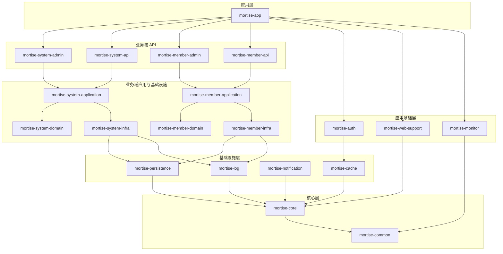

<div align="center">

<pre>
███╗   ███╗  ██████╗  ██████╗  ████████╗ ██╗ ███████╗ ███████╗
████╗ ████║ ██╔═══██╗ ██╔══██╗ ╚══██╔══╝ ██║ ██╔════╝ ██╔════╝
██╔████╔██║ ██║   ██║ ██████╔╝    ██║    ██║ ███████╗ █████╗  
██║╚██╔╝██║ ██║   ██║ ██╔══██╗    ██║    ██║ ╚════██║ ██╔══╝  
██║ ╚═╝ ██║ ╚██████╔╝ ██║  ██║    ██║    ██║ ███████║ ███████╗
╚═╝     ╚═╝  ╚═════╝  ╚═╝  ╚═╝    ╚═╝    ╚═╝ ╚══════╝ ╚══════╝
</pre>

**现代化企业级后台管理脚手架**

[](https://openjdk.org/)
[](https://spring.io/projects/spring-boot)
[](./LICENSE)
[]()
[](https://github.com/rymcu/mortise/pulls)

[快速开始](#-quick-start) • [功能特性](#-features) • [技术架构](#-项目架构) • [文档](#-文档中心) • [贡献指南](#-贡献指南)

</div>

---

## 📑 目录

- [简介](#introduction)
- [技术栈](#-技术栈)
- [功能特性](#-features)
- [环境要求](#-requirements)
- [快速开始](#-quick-start)
  - [Docker Compose 部署](#方式一docker-compose推荐)
  - [本地开发](#方式二本地开发)
  - [生产部署](#方式三生产部署)
- [监控与管理](#-监控与管理)
- [文档中心](#-文档中心)
- [项目架构](#-项目架构)
- [贡献指南](#-贡献指南)
- [社区与支持](#-社区与支持)
- [开源协议](#-开源协议)

---

## Introduction

**Mortise** 是一款现代化、模块化的企业级后台管理脚手架项目，基于 Spring Boot 3.5.7 构建。采用多模块单体架构设计，集成了完整的认证授权、监控、缓存等企业级功能，开箱即用。

### 🎯 项目特点

- 🏗️ **模块化设计** - 清晰的模块划分，低耦合高内聚
- 🚀 **开箱即用** - Docker Compose 一键启动完整环境
- 🔒 **安全可靠** - Spring Security 6 + JWT 双重保障
- 📊 **可观测性** - 集成 Prometheus + Grafana 监控体系
- ⚡ **高性能** - MyBatis-Flex + Redis 缓存优化
- 🛡️ **生产就绪** - 限流、熔断、配置加密等企业级特性

### 📸 项目预览

> 💡 **提示**: 截图即将上线，敬请期待...

<!-- 


-->

### ⚡ 性能指标

| 指标 | 数值 | 说明 |
|------|------|------|
| 🚀 启动时间 | < 10s | 应用冷启动到就绪 |
| 📦 内存占用 | ~300MB | 空闲状态 JVM 内存 |
| 🔥 QPS | 1000+ | 单机并发处理能力 |
| ⚡ 响应时间 | < 50ms | 平均 API 响应时间 |
| 💾 数据库连接池 | 10-20 | HikariCP 默认配置 |
| 🔴 Redis 命中率 | > 90% | 缓存命中率 |

> 📝 **注**: 以上数据基于 4C8G 服务器，实际性能因环境而异。

### 🚀 技术栈

**后端核心**
- **Spring Boot 3.5.7** - 主框架
- **Spring Security 6** - 安全认证框架
- **JWT (JJWT 0.12.5)** - 无状态 Token 认证
- **MyBatis-Flex 1.11.0** - 轻量级 ORM 框架
- **Redis 6.0+** - 缓存与会话存储
- **PostgreSQL 17** - 主数据库（推荐）/ MySQL 8.0+

**监控与运维**
- **Spring Boot Actuator** - 应用健康监控
- **Prometheus** - 时序数据库与指标收集
- **Grafana** - 可视化监控面板
- **HikariCP** - 高性能数据库连接池

**安全与限流**
- **Resilience4j 2.2.0** - 限流、熔断、重试
- **Jasypt 3.0.5** - 配置文件加密
- **Apache Commons** - 工具库集合（Lang3, IO, Codec, Collections4）

**开发工具**
- **SpringDoc OpenAPI** - API 文档自动生成
- **Lombok** - 简化 Java 代码
- **ULID Creator** - 分布式唯一 ID 生成器

## ✨ Features

### ✅ 已实现功能

**核心业务模块**
- [x] **用户管理** - 用户注册、登录、个人信息管理、密码修改
- [x] **角色管理** - 角色定义、权限分配、角色层级
- [x] **菜单管理** - 动态菜单加载、多级菜单支持、权限控制
- [x] **权限管理** - 基于角色的访问控制（RBAC）、细粒度权限控制
- [x] **字典管理** - 系统字典配置、字典缓存优化

**安全与认证**
- [x] **JWT 认证** - 无状态 Token 认证、自动续期、Token 刷新
- [x] **Spring Security 集成** - 统一认证授权、方法级权限控制
- [x] **配置加密** - Jasypt 敏感配置加密存储

**缓存与性能**
- [x] **多级缓存** - 统一缓存抽象、Redis 实现、缓存过期策略
- [x] **SPI 架构** - 缓存接口可扩展、支持自定义实现
- [x] **缓存预热** - 应用启动时自动加载热点数据

**监控与运维**
- [x] **Actuator 集成** - 健康检查、应用指标、端点管理
- [x] **Prometheus 集成** - 指标导出、自定义指标
- [x] **Grafana 可视化** - 实时监控面板、告警配置
- [x] **数据库监控** - HikariCP 连接池监控、慢查询分析

**限流与保护**
- [x] **Resilience4j 限流** - 基于令牌桶的限流
- [x] **熔断降级** - 自动故障恢复、服务保护

**开发体验**
- [x] **模块化架构** - 清晰的模块划分（10+ 模块）
- [x] **详细文档** - 50+ 技术文档、最佳实践指南
- [x] **Docker 支持** - 一键启动开发环境

### 🚧 开发中功能
- [ ] **操作日志** - 完整的审计日志、操作追踪
- [ ] **文件管理** - 对象存储集成、文件上传下载
- [ ] **API 文档** - SpringDoc OpenAPI 3 集成
- [ ] **通知系统** - 站内信、邮件、短信通知
- [ ] **工作流引擎** - Flowable 集成
- [ ] **多租户支持** - 租户隔离、数据隔离

### 🎯 计划功能
- [ ] **分布式事务** - Seata 集成
- [ ] **消息队列** - RocketMQ/Kafka 集成
- [ ] **全文搜索** - Elasticsearch 集成
- [ ] **定时任务** - XXL-Job 集成
- [ ] **微服务化** - Spring Cloud 改造方案

## 📋 Requirements

### 💻 开发环境

| 组件 | 版本要求 | 推荐版本 |
|------|----------|----------|
| **Java** | 21+ | Eclipse Temurin 21 |
| **Maven** | 3.6.0+ | 3.9.x |
| **数据库** | PostgreSQL 12+ / MySQL 8.0+ | PostgreSQL 17 |
| **Redis** | 6.0+ | 7.x |
| **IDE** | - | IntelliJ IDEA 2023+ |
| **Git** | 2.0+ | 最新版本 |

### 🐳 Docker 环境（推荐）

| 组件 | 版本要求 |
|------|----------|
| **Docker** | 20.10+ |
| **Docker Compose** | 2.0+ |

### 💾 资源要求

**最低配置**
- CPU: 2 核心
- 内存: 4 GB
- 磁盘: 10 GB 可用空间

**推荐配置**
- CPU: 4 核心以上
- 内存: 8 GB 以上
- 磁盘: 20 GB 可用空间（包含 Docker 镜像）

### 🌐 系统支持
- ✅ Windows 10/11
- ✅ macOS 11+
- ✅ Linux (Ubuntu 20.04+, CentOS 7+, Debian 10+)

## 🚀 Quick Start

### 方式一：Docker Compose（推荐）⭐

适合快速体验和开发环境，一键启动包含数据库、Redis、Nginx 等完整服务。

#### 1️⃣ 克隆项目

```bash
# HTTPS
git clone https://github.com/rymcu/mortise.git
cd mortise

# SSH
git clone git@github.com:rymcu/mortise.git
cd mortise
```

#### 2️⃣ 配置本地域名（可选）

```bash
# Windows (以管理员身份运行 PowerShell)
.\update_hosts.bat

# macOS/Linux
sudo ./update_hosts.sh
```

添加的域名映射：
```
127.0.0.1 rymcu.local
127.0.0.1 npm.rymcu.local
127.0.0.1 auth.rymcu.local
127.0.0.1 logto.rymcu.local
```

#### 3️⃣ 启动所有服务

```bash
# 启动服务（首次启动会下载镜像，需要几分钟）
docker-compose up -d

# 查看启动日志
docker-compose logs -f

# 检查服务状态
docker-compose ps
```

#### 4️⃣ 访问服务

| 服务 | 地址 | 说明 |
|------|------|------|
| 🌐 应用主页 | http://localhost:9999 | 主应用服务 |
| 📊 Actuator | http://localhost:9999/mortise/actuator | 监控端点 |
| 🗄️ PostgreSQL | localhost:5432 | 数据库（用户: mortise, 密码: mortise） |
| 🔴 Redis | localhost:6379 | 缓存服务 |
| 🌐 Nginx | http://localhost:80 | 反向代理 |

#### 5️⃣ 停止服务

```bash
# 停止服务
docker-compose stop

# 停止并删除容器
docker-compose down

# 停止并删除容器、网络、卷
docker-compose down -v
```

---

### 方式二：本地开发

适合日常开发调试，需要手动配置环境。

#### 1️⃣ 环境检查

```bash
# 检查 Java 版本（需要 21+）
java -version

# 检查 Maven 版本（需要 3.6+）
mvn -version

# 检查 PostgreSQL（需要安装并启动）
psql --version

# 检查 Redis（需要安装并启动）
redis-cli --version
```

#### 2️⃣ 数据库初始化

```sql
-- 连接 PostgreSQL
psql -U postgres

-- 创建数据库
CREATE DATABASE mortise;

-- 创建用户
CREATE USER mortise WITH PASSWORD 'your_password';

-- 授权
GRANT ALL PRIVILEGES ON DATABASE mortise TO mortise;

-- 退出
\q
```

#### 3️⃣ Redis 启动

```bash
# Windows (需要先安装 Redis)
redis-server

# macOS
brew services start redis

# Linux
sudo systemctl start redis
# 或
redis-server
```

#### 4️⃣ 配置应用

编辑配置文件 `mortise-app/src/main/resources/application-dev.yml`：

```yaml
spring:
  datasource:
    url: jdbc:postgresql://localhost:5432/mortise
    username: mortise
    password: your_password
  
  data:
    redis:
      host: localhost
      port: 6379
      # password: your_redis_password  # 如有密码
```

#### 5️⃣ 编译项目

```bash
# 清理并编译
mvn clean install -DskipTests

# 或只编译
mvn clean package -DskipTests
```

#### 6️⃣ 启动应用

```bash
# 方式 1: 使用 Maven 启动
cd mortise-app
mvn spring-boot:run

# 方式 2: 使用 jar 包启动
java -jar mortise-app/target/mortise-app-0.0.1.jar

# 方式 3: 指定配置文件启动
java -jar mortise-app/target/mortise-app-0.0.1.jar --spring.profiles.active=dev
```

#### 7️⃣ 验证启动

```bash
# 健康检查（需要先登录获取 Token）
curl http://localhost:9999/mortise/actuator/health

# 或在浏览器访问
http://localhost:9999/mortise/actuator
```

#### 8️⃣ 开发模式（热重载）

在 IDE 中启动：
1. 导入项目到 IntelliJ IDEA
2. 找到 `MortiseApplication.java`
3. 右键 → Run 'MortiseApplication'
4. 开启 IDEA 的 Build Project Automatically 实现热重载

---

### 方式三：生产部署

适合生产环境部署。

#### 打包应用

```bash
# 生产环境打包
mvn clean package -Pprod -DskipTests

# 生成的 jar 包位置
ls -lh mortise-app/target/mortise-app-0.0.1.jar
```

#### 使用 Docker 部署

```bash
# 构建镜像
docker build -t mortise:latest .

# 运行容器
docker run -d \
  --name mortise-app \
  -p 9999:9999 \
  -e SPRING_PROFILES_ACTIVE=prod \
  -e SPRING_DATASOURCE_URL=jdbc:postgresql://db-host:5432/mortise \
  -e SPRING_DATASOURCE_USERNAME=mortise \
  -e SPRING_DATASOURCE_PASSWORD=your_password \
  -e SPRING_DATA_REDIS_HOST=redis-host \
  mortise:latest

# 查看日志
docker logs -f mortise-app
```

#### 使用 systemd 部署（Linux）

创建服务文件 `/etc/systemd/system/mortise.service`：

```ini
[Unit]
Description=Mortise Application
After=network.target

[Service]
Type=simple
User=mortise
WorkingDirectory=/opt/mortise
ExecStart=/usr/bin/java -jar /opt/mortise/mortise-app.jar
Restart=on-failure
RestartSec=10

[Install]
WantedBy=multi-user.target
```

启动服务：

```bash
# 重载配置
sudo systemctl daemon-reload

# 启动服务
sudo systemctl start mortise

# 开机自启
sudo systemctl enable mortise

# 查看状态
sudo systemctl status mortise
```

---

### 🔧 常见问题排查

<details>
<summary><b>启动失败：数据库连接错误</b></summary>

**问题**: `Connection refused` 或 `Authentication failed`

**解决**:
1. 检查数据库是否启动：`psql -U postgres`
2. 检查用户名密码是否正确
3. 检查数据库是否已创建：`\l` 查看数据库列表
4. 检查防火墙是否开放 5432 端口
</details>

<details>
<summary><b>启动失败：Redis 连接错误</b></summary>

**问题**: `Could not connect to Redis`

**解决**:
1. 检查 Redis 是否启动：`redis-cli ping`（应返回 PONG）
2. 检查配置文件中的 Redis 地址和端口
3. 如果有密码，确保配置了正确的密码
</details>

<details>
<summary><b>Docker 启动慢</b></summary>

**问题**: `docker-compose up` 长时间无响应

**解决**:
1. 首次启动需要下载镜像，耐心等待
2. 使用国内镜像加速器
3. 查看具体日志：`docker-compose logs -f`
</details>

<details>
<summary><b>端口被占用</b></summary>

**问题**: `Port 9999 is already in use`

**解决**:
1. 修改 `application.yml` 中的端口号
2. 或停止占用端口的进程：
   - Windows: `netstat -ano | findstr 9999`
   - Linux/Mac: `lsof -i :9999`
</details>

## 📊 监控与管理

### Actuator 端点访问

应用启动后，可通过以下方式访问监控端点：

#### 1. 获取访问令牌

```bash
# PowerShell
$response = Invoke-RestMethod -Uri "http://localhost:9999/mortise/api/v1/auth/login" `
  -Method Post `
  -ContentType "application/json" `
  -Body '{"account":"your_account","password":"your_password"}'
$token = $response.data.token

# Bash/cURL
curl -X POST http://localhost:9999/mortise/api/v1/auth/login \
  -H "Content-Type: application/json" \
  -d '{"account":"your_account","password":"your_password"}'
```

#### 2. 访问监控端点

```bash
# PowerShell
Invoke-RestMethod -Uri "http://localhost:9999/mortise/actuator/health" `
  -Headers @{ Authorization = "Bearer $token" }

# Bash/cURL
curl -H "Authorization: Bearer <token>" \
  http://localhost:9999/mortise/actuator/health
```

### 📍 监控端点列表

| 端点 | 描述 | URL | 认证 |
|------|------|-----|------|
| 🏥 健康检查 | 应用整体健康状态、组件状态 | `/mortise/actuator/health` | ✅ |
| ℹ️ 应用信息 | 版本、环境、构建信息 | `/mortise/actuator/info` | ✅ |
| 📈 性能指标 | JVM、系统、应用指标 | `/mortise/actuator/metrics` | ✅ |
| 📊 Prometheus | Prometheus 格式指标导出 | `/mortise/actuator/prometheus` | ✅ |
| 📝 端点列表 | 所有可用 Actuator 端点 | `/mortise/actuator` | ✅ |
| 🗃️ 数据库 | 数据库连接池状态 | `/mortise/actuator/metrics/hikaricp.*` | ✅ |
| 🔧 配置属性 | 应用配置信息 | `/mortise/actuator/configprops` | ✅ |
| 🌿 环境变量 | 系统环境和配置 | `/mortise/actuator/env` | ✅ |

> 💡 **提示**: 所有端点都需要 JWT Token 认证

### 🎯 Prometheus + Grafana 监控

#### Prometheus 配置

```yaml
# prometheus.yml
global:
  scrape_interval: 15s
  evaluation_interval: 15s

scrape_configs:
  - job_name: 'mortise-application'
    metrics_path: '/mortise/actuator/prometheus'
    static_configs:
      - targets: ['localhost:9999']
    # JWT 认证配置
    bearer_token: 'your_jwt_token'
    # 或使用文件
    # bearer_token_file: '/path/to/token.txt'
```

#### 关键监控指标

**JVM 指标**
```
jvm_memory_used_bytes{area="heap"}        # 堆内存使用量
jvm_memory_max_bytes{area="heap"}         # 堆内存最大值
jvm_gc_pause_seconds_sum                  # GC 总耗时
jvm_threads_live_threads                  # 活跃线程数
```

**数据库连接池**
```
hikaricp_connections_active               # 活跃连接数
hikaricp_connections_idle                 # 空闲连接数
hikaricp_connections_pending              # 等待连接数
hikaricp_connections_timeout_total        # 连接超时次数
```

**HTTP 请求**
```
http_server_requests_seconds_count        # 请求总数
http_server_requests_seconds_sum          # 请求总耗时
http_server_requests_seconds_max          # 最大响应时间
```

**系统指标**
```
system_cpu_usage                          # 系统 CPU 使用率
process_cpu_usage                         # 进程 CPU 使用率
system_load_average_1m                    # 系统负载
```

#### Grafana 面板推荐

1. **Spring Boot 2.1 Statistics** (Dashboard ID: 6756)
2. **JVM (Micrometer)** (Dashboard ID: 4701)
3. **Spring Boot APM Dashboard** (Dashboard ID: 12900)

导入方式：Grafana → Dashboards → Import → 输入 Dashboard ID

### 📚 详细监控文档

- [Actuator 访问指南](docs/actuator-access-guide.md)
- [自定义监控集成](docs/CUSTOM_MONITORING_GUIDE.md)
- [性能监控最佳实践](docs/PERFORMANCE_MONITORING_INTEGRATION.md)
- [数据库监控配置](docs/database-monitoring-fixes.md)


## 🎮 快速命令参考

### Maven 命令

```bash
# 清理编译
mvn clean install

# 跳过测试编译
mvn clean install -DskipTests

# 运行测试
mvn test

# 打包应用
mvn package

# 运行应用
mvn spring-boot:run

# 查看依赖树
mvn dependency:tree

# 更新依赖
mvn versions:display-dependency-updates
```

### Docker 命令

```bash
# 启动所有服务
docker-compose up -d

# 查看日志
docker-compose logs -f [service_name]

# 停止服务
docker-compose stop

# 重启服务
docker-compose restart [service_name]

# 删除容器和网络
docker-compose down

# 删除容器、网络和卷
docker-compose down -v

# 重新构建镜像
docker-compose build --no-cache

# 查看服务状态
docker-compose ps
```

### Git 命令

```bash
# 克隆项目
git clone https://github.com/rymcu/mortise.git

# 创建功能分支
git checkout -b feature/your-feature

# 提交更改
git add .
git commit -m "feat: your feature description"

# 推送到远程
git push origin feature/your-feature

# 同步上游
git fetch upstream
git rebase upstream/master
```

### Redis 命令

```bash
# 连接 Redis
redis-cli

# 查看所有键
KEYS *

# 查看键值
GET key_name

# 删除键
DEL key_name

# 清空数据库
FLUSHDB

# 查看内存使用
INFO memory
```

### PostgreSQL 命令

```bash
# 连接数据库
psql -U mortise -d mortise

# 查看所有表
\dt

# 查看表结构
\d table_name

# 执行 SQL 文件
\i path/to/file.sql

# 导出数据库
pg_dump -U mortise mortise > backup.sql

# 导入数据库
psql -U mortise mortise < backup.sql
```

---

## 📚 文档中心

项目包含 **50+ 份**详细技术文档，位于 [`docs/`](docs/) 目录。

### 🚀 快速开始
- [快速开始指南](docs/quickstart/QUICK_START.md) - 三步快速启动项目
- [系统迁移指南](docs/migration/mortise-system-migration-guide.md) - 模块迁移完整流程

### 🏗️ 架构设计
- [架构说明](docs/architecture/architecture.md) - 分层与模块职责
- [项目架构优化](docs/architecture/project-architecture-optimization.md) - 整体架构设计
- [模块依赖与 SPI 架构](docs/architecture/module-dependency-and-spi-architecture.md) - 模块化设计原则
- [架构重构计划](docs/architecture/ARCHITECTURE_REFACTOR_PLAN.md) - 重构路线图

### 📌 需求规范 (spec-kit)
- [规范中心](docs/specs/README.md) - 规范目录与命名规则
- [落地流程](docs/specs/WORKFLOW.md) - 规范先行流程
- [规范模板](docs/specs/templates/feature-spec.md) - 新需求模板

### 🔧 配置与优化
- [Spring Boot 自动配置优化](docs/configuration/spring-boot-autoconfiguration-optimization.md)
- [数据库性能优化](docs/database/database-performance-optimization.md)
- [MyBatis-Flex 配置指南](docs/configuration/mybatis-flex-config-fixes.md)
- [循环依赖修复方案](docs/configuration/circular-dependency-fixes.md)
- [应用启动时间优化](docs/performance/app-startup-time-fix.md)

### 🧪 缓存系统
- [缓存统一实现报告](docs/caching/cache-unification-complete-report.md)
- [缓存优化指南](docs/caching/cache-optimization-guide.md)
- [缓存过期 SPI 指南](docs/caching/cache-expiration-spi-guide.md)
- [Redis 键过期监听升级](docs/caching/redis-key-expiration-listener-upgrade.md)
- [字典缓存实现](docs/caching/dict-cache-implementation.md)

### 📊 监控与运维
- [Actuator 访问指南](docs/monitoring/actuator-access-guide.md)
- [自定义监控集成](docs/monitoring/CUSTOM_MONITORING_GUIDE.md)
- [性能监控最佳实践](docs/monitoring/PERFORMANCE_MONITORING_INTEGRATION.md)
- [数据库监控配置](docs/monitoring/database-monitoring-fixes.md)
- [健康检查配置](docs/monitoring/health-check-config-fixes.md)
- [监控架构总结](docs/monitoring/monitoring-architecture-summary.md)

### 🛡️ 安全与限流
- [限流方案实现](docs/security/rate-limiting.md)
- [限流方案对比](docs/security/rate-limit-comparison.md)
- [限流迁移计划](docs/security/RATELIMIT_MIGRATION_PLAN.md)
- [JWT 属性重构](docs/security/jwt-properties-refactoring.md)
- [OAuth2 配置指南](docs/oauth2/oauth2-configuration-guide.md)
- [认证管理器修复](docs/security/authentication-manager-fix.md)

### 🔄 迁移指南
- [系统迁移检查清单](docs/migration/mortise-system-migration-checklist.md)
- [系统迁移计划 V2](docs/migration/mortise-system-migration-plan-v2.md)
- [OAuth2 缓存服务迁移](docs/migration/oauth2-cache-service-migration.md)
- [OAuth2 序列化器迁移](docs/migration/oauth2-serializer-migration.md)
- [缓存迁移总结](docs/migration/CACHE_MIGRATION_SUMMARY.md)

### 📈 项目报告
- [第一阶段报告](docs/reports/PHASE1_REPORT.md)
- [第三阶段报告](docs/reports/PHASE3_REPORT.md)
- [第三阶段总结](docs/reports/PHASE3_SUMMARY.md)
- [第四阶段报告](docs/reports/PHASE4_REPORT.md)
- [第五阶段报告](docs/reports/PHASE5_REPORT.md)

### 🐛 问题修复
- [配置问题修复](docs/configuration/configuration-fixes.md)
- [最终配置修复](docs/configuration/final-config-fixes.md)
- [MyBatis-Flex 参数绑定修复](docs/configuration/mybatisflex-parameter-binding-fix.md)
- [事件监听器时序分析](docs/refactor/event-listener-timing-analysis.md)

### 📖 完整文档索引
查看完整文档列表：[docs/migration/MIGRATION_INDEX.md](docs/migration/MIGRATION_INDEX.md)

## 🏛️ 项目架构

### 模块说明

```
mortise/
├── mortise-common/          # 公共模块 - 通用工具类、异常定义
├── mortise-core/            # 核心模块 - 基础配置、结果封装
├── mortise-cache/           # 缓存模块 - 缓存抽象与 Redis 实现
├── mortise-auth/            # 认证模块 - JWT、Spring Security 集成
├── mortise-web-support/     # Web 支撑 - 全局异常、拦截器、OpenAPI
├── mortise-test-support/    # 测试支撑 - 共享测试配置
├── mortise-system/          # 系统域聚合
│   ├── mortise-system-domain/       # 领域模型与常量
│   ├── mortise-system-application/  # 应用服务
│   ├── mortise-system-infra/        # 基础设施实现
│   ├── mortise-system-admin/        # 管理端接口
│   └── mortise-system-api/          # 公共 API 接口
├── mortise-member/          # 会员域聚合
│   ├── mortise-member-domain/
│   ├── mortise-member-application/
│   ├── mortise-member-infra/
│   ├── mortise-member-admin/
│   └── mortise-member-api/
├── mortise-log/             # 日志模块 - 操作日志、审计日志
├── mortise-monitor/         # 监控模块 - Actuator、指标自定义
├── mortise-notification/    # 通知模块 - 消息通知服务
└── mortise-app/             # 应用模块 - 启动类、配置整合
```

### 架构图



### 依赖矩阵（简化）

| 层级 | 允许依赖 |
| --- | --- |
| L6 应用层 | L1-L5 全部模块 |
| L5 业务域 API | L3-L4 与本域 domain/application/infra |
| L4 业务域应用与基础设施 | L1-L3 与本域 domain |
| L3 应用基础层 | L1-L2 |
| L2 基础设施层 | L1 |
| L1 核心层 | 无 |

### 技术特色

**🎯 SPI 架构设计**
- 缓存接口抽象，支持多种实现（Redis、本地缓存）
- Jackson 序列化器可扩展
- 监控指标自定义接口

**🔄 缓存过期策略**
- 统一过期时间管理
- Redis 键空间通知监听
- 自动缓存刷新机制

**📊 可观测性**
- 自定义 Actuator 端点
- Prometheus 指标导出
- HikariCP 连接池监控
- 应用性能指标收集

**🛡️ 安全保障**
- JWT Token 认证
- Spring Security 方法级权限
- Jasypt 配置加密
- Resilience4j 限流保护

## 🤝 贡献指南

我们欢迎并感谢任何形式的贡献！

### 🌟 如何贡献

#### 报告问题
- 在 [GitHub Issues](https://github.com/rymcu/mortise/issues) 创建 Issue
- 清晰描述问题、重现步骤、期望行为
- 提供错误日志、截图等相关信息

#### 提交功能建议
- 在 [GitHub Discussions](https://github.com/rymcu/mortise/discussions) 发起讨论
- 说明功能的使用场景和价值
- 提供参考实现或设计思路

#### 代码贡献流程

1. **Fork 项目**
   ```bash
   # Fork 后克隆到本地
   git clone https://github.com/YOUR_USERNAME/mortise.git
   cd mortise
   ```

2. **创建功能分支**
   ```bash
   git checkout -b feature/amazing-feature
   # 或修复分支
   git checkout -b fix/bug-description
   ```

3. **编写代码**
   - 遵循项目代码规范
   - 添加必要的注释和文档
   - 编写单元测试

4. **提交变更**
   ```bash
   git add .
   git commit -m 'feat: add amazing feature'
   # 使用 Conventional Commits 规范
   ```

5. **同步上游代码**
   ```bash
   git remote add upstream https://github.com/rymcu/mortise.git
   git fetch upstream
   git rebase upstream/master
   ```

6. **推送到 GitHub**
   ```bash
   git push origin feature/amazing-feature
   ```

7. **创建 Pull Request**
   - 访问 GitHub 仓库页面
   - 点击 "New Pull Request"
   - 填写 PR 描述、关联 Issue
   - 等待代码审查

### 📝 开发规范

**代码风格**
- 遵循 [阿里巴巴 Java 开发手册](https://github.com/alibaba/p3c)
- 使用 IDE 格式化工具（提供配置文件）
- 类、方法添加 Javadoc 注释

**提交信息规范**

使用 [Conventional Commits](https://www.conventionalcommits.org/) 格式：

```
<type>(<scope>): <subject>

<body>

<footer>
```

**Type 类型：**
- `feat`: 新功能
- `fix`: Bug 修复
- `docs`: 文档变更
- `style`: 代码格式（不影响功能）
- `refactor`: 重构（不增加功能不修复 Bug）
- `perf`: 性能优化
- `test`: 测试相关
- `chore`: 构建工具、依赖管理

**示例：**
```bash
feat(auth): add password encryption support

- Implement BCrypt password encoder
- Add password strength validation
- Update user registration flow

Closes #123
```

**测试要求**
- 新功能必须包含单元测试
- 测试覆盖率不低于 70%
- 确保所有测试通过

**文档要求**
- 新功能需要更新相关文档
- API 变更需要更新接口文档
- 重要变更需要在 CHANGELOG.md 记录

### 🔍 代码审查

所有 Pull Request 都需要经过代码审查：
- 至少 1 位维护者审批
- 通过所有 CI 检查
- 解决所有审查意见
- 保持提交历史清晰

## 📞 社区与支持

### 💬 获取帮助

| 渠道 | 用途 | 响应时间 |
|------|------|----------|
| 📖 [技术文档](docs/) | 查阅详细文档 | 即时 |
| 🐛 [GitHub Issues](https://github.com/rymcu/mortise/issues) | Bug 报告、问题追踪 | 1-3 天 |
| 💡 [GitHub Discussions](https://github.com/rymcu/mortise/discussions) | 功能建议、技术讨论 | 3-7 天 |
| 📧 Email | 商务合作、私密问题 | 7 天内 |

### 🌍 社区资源

- **官方网站**: https://rymcu.com
- **在线演示**: _即将上线_
- **API 文档**: _开发中_
- **视频教程**: _计划中_

### ❓ 常见问题

<details>
<summary><b>Q: 支持哪些数据库？</b></summary>

A: 目前支持 PostgreSQL（推荐）和 MySQL。推荐使用 PostgreSQL 17，性能和功能更完善。
</details>

<details>
<summary><b>Q: 可以用于商业项目吗？</b></summary>

A: 可以。本项目基于 MIT 协议，可免费用于商业项目。
</details>

<details>
<summary><b>Q: 如何升级 Spring Boot 版本？</b></summary>

A: 修改 `pom.xml` 中的 `spring-boot-starter-parent` 版本，然后执行 `mvn clean install` 测试兼容性。
</details>

<details>
<summary><b>Q: 监控端点需要认证吗？</b></summary>

A: 是的。所有 Actuator 端点都需要 JWT Token 认证，确保生产环境安全。
</details>

<details>
<summary><b>Q: 如何自定义缓存实现？</b></summary>

A: 实现 `CacheService` 接口，通过 SPI 机制注册自定义实现。参考 [缓存过期 SPI 指南](docs/cache-expiration-spi-guide.md)。
</details>

## � 项目状态


### 📅 版本历史

| 版本 | 发布日期 | 主要更新 |
|------|----------|----------|
| v0.0.1 | 2024-09-24 | 🎉 首次发布：核心功能、基础架构 |

### 🗺️ 发展路线图

```
v0.0.1 (✅ 已完成)
├─ 用户、角色、菜单管理
├─ JWT 认证授权
├─ Redis 缓存集成
├─ Actuator 监控
└─ 基础文档

v0.2.0 (🚧 开发中 - 预计 Q1 2025)
├─ 操作日志完善
├─ 文件上传管理
├─ API 文档集成
├─ 监控告警优化
└─ 性能优化

v0.3.0 (📋 计划中 - 预计 Q2 2025)
├─ 通知系统
├─ 工作流引擎
├─ 多租户支持
├─ 前端管理界面
└─ 单元测试覆盖

v1.0.0 (🎯 目标 - 预计 Q3 2025)
├─ 生产就绪认证
├─ 完整测试覆盖
├─ 性能基准测试
├─ 安全加固
└─ 详尽使用手册

v2.0.0 (💡 展望)
├─ 微服务架构
├─ 消息队列集成
├─ 分布式事务
├─ 全文搜索
└─ 大数据分析
```

## 📄 开源协议

本项目基于 **[MIT License](./LICENSE)** 开源协议。

```
MIT License

Copyright (c) 2024 RYMCU

Permission is hereby granted, free of charge, to any person obtaining a copy
of this software and associated documentation files (the "Software"), to deal
in the Software without restriction...
```

### 使用许可

✅ 商业使用  
✅ 修改  
✅ 分发  
✅ 私人使用  

⚠️ 需保留版权声明  
⚠️ 需保留许可声明  

## 🙏 致谢

### 贡献者

感谢所有为本项目做出贡献的开发者：

[](https://github.com/rymcu/mortise/graphs/contributors)

### 技术栈致谢

本项目基于以下优秀的开源项目构建：

- [Spring Boot](https://spring.io/projects/spring-boot) - 应用框架
- [Spring Security](https://spring.io/projects/spring-security) - 安全框架
- [MyBatis-Flex](https://mybatis-flex.com/) - ORM 框架
- [Redis](https://redis.io/) - 缓存数据库
- [PostgreSQL](https://www.postgresql.org/) - 关系型数据库
- [Resilience4j](https://resilience4j.readme.io/) - 容错库
- [Prometheus](https://prometheus.io/) - 监控系统
- [Grafana](https://grafana.com/) - 可视化平台

### 特别感谢

- 感谢 JetBrains 提供的开源许可证
- 感谢所有提供反馈和建议的用户

## 🔗 相关链接

### 📌 项目资源

| 资源 | 链接 | 描述 |
|------|------|------|
| 🏠 项目主页 | [GitHub](https://github.com/rymcu/mortise) | 源代码仓库 |
| 📖 文档中心 | [Docs](https://github.com/rymcu/mortise/tree/master/docs) | 完整技术文档 |
| 🐛 问题追踪 | [Issues](https://github.com/rymcu/mortise/issues) | Bug 报告与功能请求 |
| 💬 讨论区 | [Discussions](https://github.com/rymcu/mortise/discussions) | 技术讨论与交流 |
| 📝 变更日志 | [Releases](https://github.com/rymcu/mortise/releases) | 版本发布记录 |
| 👥 贡献者 | [Contributors](https://github.com/rymcu/mortise/graphs/contributors) | 项目贡献者列表 |
| 📊 代码统计 | [Insights](https://github.com/rymcu/mortise/pulse) | 项目活跃度统计 |

### 🌟 Star History

[](https://star-history.com/#rymcu/mortise&Date)

### 🔗 相关项目

- [Nebula](https://github.com/rymcu/nebula) - RYMCU 社区前端项目
- [Forest](https://github.com/rymcu/forest) - RYMCU 社区后端项目

---

<div align="center">

**如果这个项目对你有帮助，请给一个 ⭐ Star 支持一下！**

Made with ❤️ by [RYMCU](https://github.com/rymcu)

**最后更新**: 2025-10-02  
**当前版本**: v0.0.1  
**维护者**: [RYMCU 开发团队](https://github.com/rymcu)

</div>
