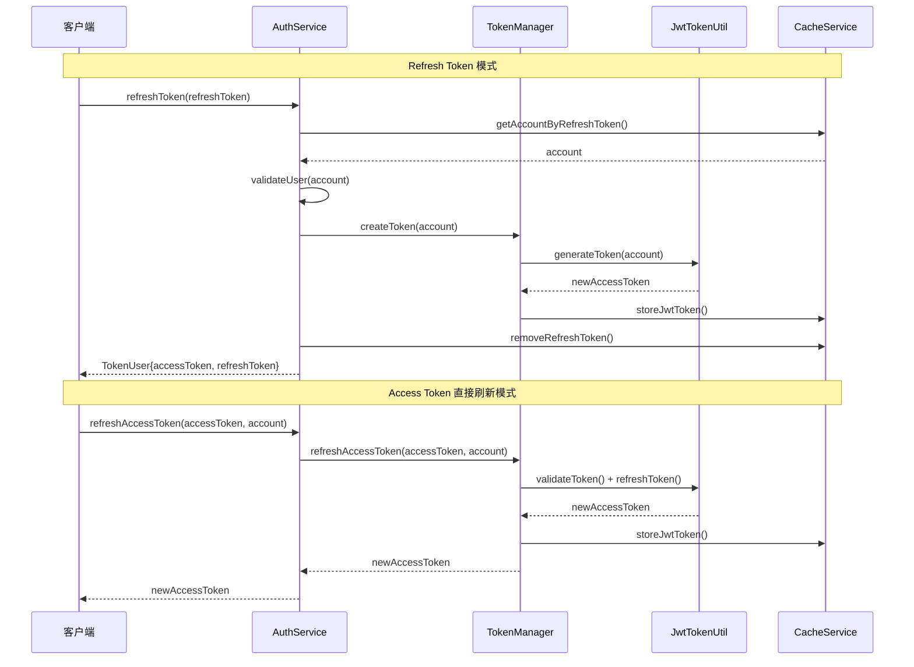

# JWT Token 刷新机制完整实现

## 概述

本文档描述了 Mortise 项目中实现的安全、高效的 JWT Token 刷新机制。该机制支持两种刷新模式：

1. **Refresh Token 模式**：使用长期有效的 Refresh Token 获取新的 Access Token
2. **Access Token 直接刷新模式**：在 Access Token 即将过期时直接刷新

## 架构设计

### 核心组件

1. **JwtTokenUtil**：JWT Token 的核心工具类
2. **TokenManager**：Token 管理接口和实现
3. **AuthService**：认证服务接口和实现
4. **CacheService**：缓存服务（存储 Refresh Token）

### 刷新机制流程



## 安全特性

### 1. 刷新窗口期机制

- **配置项**：`jwt.refresh-window`（默认 5 分钟）
- **作用**：只允许在 Token 即将过期前的特定时间窗口内刷新
- **好处**：防止滥用刷新机制，减少不必要的刷新操作

```yaml
jwt:
  expiration: 1800000      # 30 分钟
  refresh-window: 300000   # 5 分钟
```

### 2. Token 验证机制

```java
// 验证步骤
1. 检查 Token 是否已过期
2. 验证 Token 签名
3. 检查是否在刷新窗口期内
4. 验证缓存中的 Token 是否匹配
5. 生成新的 Token
```

### 3. 一次性使用原则

- **Refresh Token**：使用后立即删除，防止重放攻击
- **缓存同步**：新 Token 生成后立即更新缓存

## 实现详情

### JwtTokenUtil 关键方法

```java
/**
 * 刷新 Token - 安全实现
 */
public String refreshToken(String token) {
    // 1. 验证 Token 是否已过期
    if (isTokenExpired(token)) {
        return null;
    }
    
    // 2. 检查刷新窗口期
    Date expirationDate = getExpirationDateFromToken(token);
    long timeUntilExpiration = expirationDate.getTime() - System.currentTimeMillis();
    if (timeUntilExpiration > refreshWindow) {
        return null; // 尚未到刷新窗口期
    }
    
    // 3. 提取和过滤 Claims
    // 4. 生成新 Token
}
```

### TokenManager 接口扩展

```java
public interface TokenManager {
    String createToken(String id);
    boolean checkToken(TokenModel model);
    TokenModel getToken(String token, String account);
    void deleteToken(String account);
    
    // 新增：Access Token 直接刷新
    String refreshAccessToken(String oldToken, String account);
}
```

### AuthService 双模式支持

```java
public interface AuthService {
    // 模式1：使用 Refresh Token 刷新
    TokenUser refreshToken(String refreshToken);
    
    // 模式2：直接刷新 Access Token
    String refreshAccessToken(String accessToken, String account);
}
```

## 使用场景

### 场景1：用户主动刷新

```java
// 前端检测到 Token 即将过期，使用 Refresh Token 获取新令牌
POST /auth/refresh
{
    "refreshToken": "ulid_refresh_token"
}

Response:
{
    "accessToken": "new_jwt_token",
    "refreshToken": "new_ulid_refresh_token"
}
```

### 场景2：拦截器自动刷新

```java
// 请求拦截器检测到 Token 在刷新窗口期内，自动刷新
if (shouldRefreshToken(accessToken)) {
    String newToken = authService.refreshAccessToken(accessToken, account);
    if (newToken != null) {
        // 更新请求头中的 Token
        request.setHeader("Authorization", "Bearer " + newToken);
    }
}
```

## 配置说明

### application.yml 配置

```yaml
jwt:
  secret: "your-secret-key-please-change-in-production"
  expiration: 1800000        # Access Token 有效期：30分钟
  refresh-window: 300000     # 刷新窗口期：5分钟
  header: "Authorization"    # Token 请求头
  token-prefix: "Bearer "    # Token 前缀

cache:
  refresh-token:
    ttl: 2592000000          # Refresh Token TTL：30天
```

## 错误处理

### 刷新失败场景

1. **Token 已过期**：返回 null，要求重新登录
2. **未到刷新窗口期**：返回 null，继续使用原 Token
3. **Token 无效**：返回 null，可能需要重新登录
4. **缓存不匹配**：返回 null，Token 可能已被注销

### 日志级别

```java
log.warn()  - 异常情况（过期、无效等）
log.debug() - 正常的"尚未到期"情况
log.info()  - 成功刷新
log.error() - 系统异常
```

## 性能优化

### 1. 缓存优化

- **SecretKey 缓存**：避免重复生成
- **JwtParser 缓存**：提高解析性能
- **Token 缓存**：减少数据库查询

### 2. 减少不必要操作

- **智能刷新**：只在需要时刷新
- **批量操作**：缓存的批量更新
- **异步处理**：非关键操作异步执行

## 最佳实践

### 前端集成

```javascript
// Token 刷新策略
class TokenManager {
    async refreshTokenIfNeeded() {
        const token = this.getAccessToken();
        const expiresIn = this.getTokenExpiresIn(token);
        
        // 在过期前5分钟尝试刷新
        if (expiresIn < 5 * 60 * 1000) {
            try {
                const newToken = await this.refreshAccessToken(token);
                if (newToken) {
                    this.setAccessToken(newToken);
                    return newToken;
                }
            } catch (error) {
                // 刷新失败，使用 Refresh Token
                return this.refreshWithRefreshToken();
            }
        }
        return token;
    }
}
```

### 安全建议

1. **生产环境**：
   - 使用强密码作为 JWT secret
   - 启用 HTTPS
   - 设置合理的过期时间

2. **监控**：
   - 记录刷新频率
   - 监控异常刷新行为
   - 设置告警机制

3. **备用方案**：
   - 刷新失败时的降级策略
   - 多重验证机制
   - 黑名单机制

## 总结

本刷新机制具有以下优势：

✅ **安全性**：刷新窗口期、一次性使用、Token 验证  
✅ **性能**：缓存优化、智能刷新、减少不必要操作  
✅ **灵活性**：双模式支持、可配置参数  
✅ **可维护性**：清晰的架构、详细的日志、错误处理  

该实现符合 JWT 最佳实践，适用于生产环境。