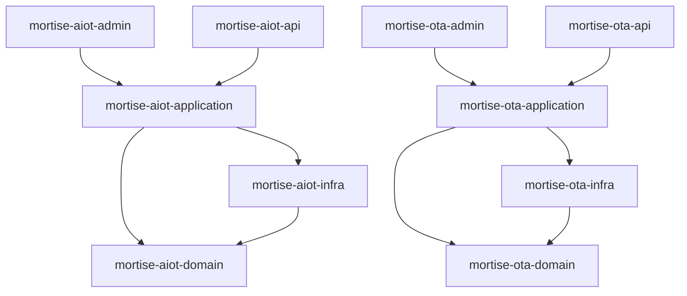
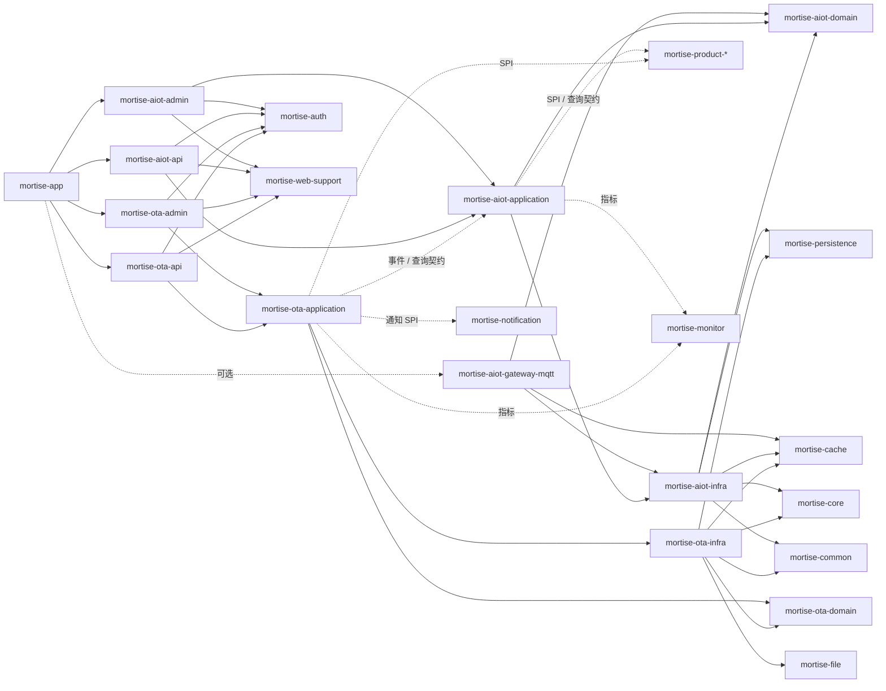

# AIoT 与 OTA 模块架构设计

本文档基于 Mortise 当前的多模块单体与业务域分层架构，给出 AIoT 模块与 OTA 模块的推荐落地方案，重点覆盖：

- 模块目录树与 Maven 依赖图
- AIoT 与 OTA 的核心表设计
- 设备端与管理端 API 清单
- 物模型是否需要设计，以及应落在哪个模块
- 实体代码模式与 Flyway 迁移规范
- 安全扩展与设备认证方案
- 领域事件定义与错误码体系
- 配置项与可观测性设计

## 当前执行细项计划

### 已完成

- 根仓库已接入 `mortise-aiot`、`mortise-aiot-gateway-mqtt`、`mortise-ota` 三个商业模块入口，并挂到根 `pom.xml` 与 `mortise-app/pom.xml` 的 `pro` profile。
- 已创建 AIoT / OTA / MQTT gateway 的聚合 pom、领域实体、Mapper、Flyway、配置属性与基础 SPI。
- AIoT 已落地真实设备链路：注册、激活、设备令牌签发、心跳、影子上报、期望态读取。
- OTA 已落地真实管理与设备链路：固件创建、固件发布、升级批次创建、设备升级检查、下载票据签发、manifest 票据消费。
- AIoT 已补齐运行期闭环：遥测快照落库与缓存、命令下发记录、设备拉取待执行命令、指令回执落库。
- OTA 已补齐设备侧执行闭环：升级进度上报、升级结果回写、回滚结果记录、批次成功/失败统计聚合。
- OTA 已通过 AIoT SPI 完成升级成功/回滚后的设备固件版本回写，不直接跨域读写 OTA 表。
- 已增加设备专用 JWT 过滤链，设备端接口不再复用用户登录态。
- 已完成最小 Maven 校验：`mvn -pl mortise-app -am -Ppro -DskipTests compile`。

### 当前代码状态与下一步

1. 第一步：仓库装配
    - 目标：保留主仓库中的 `pro` 组装方式，并将 AIoT/OTA 代码迁移为真实子仓库。
    - 状态：主仓库装配、独立仓库推送与 gitlink 切换均已完成。

2. 第二步：AIoT 核心闭环
    - 目标：设备注册、激活、JWT、心跳、影子链路可直接联调。
    - 状态：已完成第一版可落库实现，并补齐遥测上报、命令拉取与指令回执；已补齐 AIOT 运行配置、MQTT broker / route 配置表与管理接口。
    - 待补充：设备冻结/退役等运营接口，以及基于 EMQX 的真实发布 / 订阅联调。

3. 第三步：OTA 核心闭环
    - 目标：固件元数据、发布、批次生成、设备检查升级、票据消费 manifest。
    - 状态：已完成第一版可落库实现，并补齐进度上报、结果回写、回滚结果记录与批次统计回收。
    - 待补充：兼容矩阵校验、失败重试与更细粒度的回滚编排。

4. 第四步：跨模块协作收口
    - 目标：OTA 通过 AIoT 查询契约拿设备快照，不直接读 AIoT 表。
    - 状态：已通过 `DeviceSnapshotQueryService` 打通按设备编码查询快照，并通过 `DeviceFirmwareWritebackService` 回写升级后的设备固件版本。
    - 待补充：更多设备查询维度与基于事件的后续运营编排。

5. 第五步：联调与回归
    - 目标：补接口测试、设备模拟调用脚本、EMQX broker 实链路集成与多 broker 路由验证。
    - 状态：已完成 `mvn -Ppro -pl mortise-aiot\mortise-aiot-admin,mortise-ota\mortise-ota-admin,mortise-aiot-gateway-mqtt -am test` 最小回归验证。

## 1. 设计目标

### 1.1 业务边界

- **AIoT 模块**负责设备生命周期、连接态、遥测、影子、指令、告警。
- **OTA 模块**负责固件资产、版本发布、灰度升级、升级任务、回滚与结果审计。
- **mortise-product** 继续负责通用主数据目录，复用产品类型扩展能力承载 `device_model` 与 `firmware` 两类资源。
- **mortise-file** 负责固件文件与 manifest 文件的存储，不在 OTA 表中直接保存大二进制。

### 1.2 架构约束

- 继续遵循 `domain / application / infra / admin / api` 的业务域拆分。
- 同层模块不直接相互依赖，跨域协作优先通过 SPI、事件、聚合层装配。
- 控制面与数据面分离：核心事务数据先落 PostgreSQL，在线态与短期运行态缓存放 Redis。
- 不把设备协议适配、厂商适配、文件存储细节下沉到 `mortise-common` 或 `mortise-core`。
- 所有新增实体遵循现有 MyBatis-Flex 注解模式：`@Table(schema = "mortise")`、`@Id(keyType = KeyType.Generator, value = KeyGenerators.flexId)`、实现 `Serializable`。
- 表名统一使用 `mortise_aiot_*` / `mortise_ota_*` 前缀，与项目已有 `mortise_*` 命名规范保持一致。
- 时间戳字段统一命名为 `created_time` / `updated_time`，与现有实体保持一致。
- 需要软删除的表统一使用 `del_flag INTEGER NOT NULL DEFAULT 0` 字段。

## 2. 总体模块方案

## 2.1 推荐新增模块

```text
mortise-aiot/
├── mortise-aiot-domain
├── mortise-aiot-application
├── mortise-aiot-infra
├── mortise-aiot-admin
└── mortise-aiot-api

mortise-aiot-gateway-mqtt/        ← 第一阶段即引入
mortise-aiot-gateway-{vendor}/    ← 可选，按厂商按需引入

mortise-ota/
├── mortise-ota-domain
├── mortise-ota-application
├── mortise-ota-infra
├── mortise-ota-admin
└── mortise-ota-api
```

## 2.2 模块职责拆分

| 模块 | 定位 | 主要内容 |
|------|------|----------|
| `mortise-aiot-domain` | AIoT 领域层 | 设备、设备分组、设备凭据、设备影子、命令、遥测模型、告警规则、物模型、领域事件、仓储接口 |
| `mortise-aiot-application` | AIoT 应用层 | 设备注册激活、绑定、影子同步、命令下发、告警编排、设备快照查询 |
| `mortise-aiot-infra` | AIoT 基础设施层 | Mapper、Flyway、设备认证存储、Redis 在线态 |
| `mortise-aiot-gateway-mqtt` | MQTT 协议适配 | MQTT 客户端、消息收发、协议转换，实现 `DeviceProtocolGateway` SPI（第一阶段引入） |
| `mortise-aiot-gateway-{vendor}` | 厂商平台适配（可选） | 第三方设备平台 SDK 集成，按厂商拆分独立模块 |
| `mortise-aiot-admin` | AIoT 管理端 | 设备台账、标签分组、型号挂接、命令下发、物模型维护、告警规则维护 |
| `mortise-aiot-api` | AIoT 设备端 API | 设备注册、激活、心跳、影子上报、遥测上报、命令拉取、回执上报 |
| `mortise-ota-domain` | OTA 领域层 | 固件包、固件版本、兼容矩阵、升级策略、升级批次、升级任务、升级结果、回滚策略 |
| `mortise-ota-application` | OTA 应用层 | 固件发布审批、灰度批次编排、升级任务拆分、失败重试、回滚、结果聚合 |
| `mortise-ota-infra` | OTA 基础设施层 | Mapper、Flyway、文件关联、签名与摘要校验、下载授权、调度任务 |
| `mortise-ota-admin` | OTA 管理端 | 固件上传、发布、兼容矩阵、灰度规则、批次监控、失败分析、回滚 |
| `mortise-ota-api` | OTA 设备端 API | 查询可升级版本、获取 manifest、下载授权、上报升级进度与结果 |

## 2.3 与现有模块的边界关系

| 现有模块 | 与 AIoT / OTA 的关系 |
|----------|----------------------|
| `mortise-product` | 复用产品主数据，注册 `device_model` 与 `firmware` 两个产品类型 |
| `mortise-file` | 存储固件文件、差分包、manifest、签名文件 |
| `mortise-cache` | 设备在线态、影子缓存、下载令牌、升级窗口、任务幂等键 |
| `mortise-notification` | 批次异常、审批通知、失败阈值告警 |
| `mortise-auth` | 管理员接口复用现有认证，设备端接口通过安全扩展点挂设备认证链 |
| `mortise-monitor` | 采集设备接入量、命令成功率、升级成功率、超时率 |

> **商业子模块说明**：`mortise-aiot`、`mortise-aiot-gateway-mqtt`、`mortise-ota` 均为商业模块，通过 git submodule 引入，不在根 pom 默认 `<modules>` 中，而是由 `pro` Profile 条件装配。详见 [§4.3](#43-根-pom-与装配)。

## 3. 模块目录树

## 3.1 AIoT 模块目录树

```text
mortise-aiot/
├── pom.xml
├── mortise-aiot-domain/
│   ├── pom.xml
│   └── src/main/java/com/rymcu/mortise/aiot/
│       ├── entity/
│       │   ├── Device.java
│       │   ├── DeviceBinding.java
│       │   ├── DeviceCredential.java
│       │   ├── DeviceGroup.java
│       │   ├── DeviceGroupMember.java
│       │   ├── DeviceModelBinding.java
│       │   ├── DeviceShadow.java
│       │   ├── DeviceCommand.java
│       │   ├── DeviceCommandReply.java
│       │   ├── DeviceTelemetrySnapshot.java
│       │   ├── AlertRule.java
│       │   ├── AlertEvent.java
│       │   ├── ThingModel.java
│       │   └── ThingModelProperty.java
│       ├── enums/
│       │   ├── ActivationStatus.java
│       │   ├── OnlineStatus.java
│       │   ├── CommandStatus.java
│       │   ├── CredentialType.java
│       │   ├── AlertSeverity.java
│       │   └── ThingModelSpecType.java
│       ├── constant/
│       ├── event/
│       │   ├── DeviceOnlineEvent.java
│       │   ├── DeviceOfflineEvent.java
│       │   ├── DeviceRegisteredEvent.java
│       │   ├── DeviceActivatedEvent.java
│       │   ├── DeviceShadowUpdatedEvent.java
│       │   └── AlertTriggeredEvent.java
│       ├── model/
│       └── spi/
│           ├── DeviceProtocolGateway.java
│           ├── DeviceSnapshotQueryService.java
│           ├── DeviceReachabilityService.java
│           └── ThingModelQueryService.java
├── mortise-aiot-application/
│   ├── pom.xml
│   └── src/main/java/com/rymcu/mortise/aiot/
│       └── service/
│           ├── DeviceService.java
│           ├── DeviceShadowService.java
│           ├── DeviceCommandService.java
│           ├── DeviceGroupService.java
│           ├── ThingModelService.java
│           ├── AlertRuleService.java
│           └── impl/
├── mortise-aiot-infra/
│   ├── pom.xml
│   └── src/main/java/com/rymcu/mortise/aiot/
│       ├── mapper/
│       │   ├── DeviceMapper.java
│       │   ├── DeviceCredentialMapper.java
│       │   ├── DeviceShadowMapper.java
│       │   ├── DeviceCommandMapper.java
│       │   ├── DeviceGroupMapper.java
│       │   ├── ThingModelMapper.java
│       │   ├── AlertRuleMapper.java
│       │   └── AlertEventMapper.java
│       ├── cache/
│       │   └── AiotCacheService.java
│       └── config/
│           └── AiotConfiguration.java
│   └── src/main/resources/db/migration/
│       ├── V200__Create_AIoT_Device_Tables.sql
│       ├── V201__Create_AIoT_Shadow_Command_Tables.sql
│       ├── V202__Create_AIoT_ThingModel_Tables.sql
│       └── V203__Create_AIoT_Alert_Tables.sql
├── mortise-aiot-admin/
│   ├── pom.xml
│   └── src/main/java/com/rymcu/mortise/aiot/admin/
│       ├── controller/
│       │   ├── AdminDeviceController.java
│       │   ├── AdminDeviceGroupController.java
│       │   ├── AdminThingModelController.java
│       │   └── AdminAlertRuleController.java
│       ├── dto/
│       └── vo/
└── mortise-aiot-api/
    ├── pom.xml
    └── src/main/java/com/rymcu/mortise/aiot/api/
        ├── controller/
        │   ├── DeviceRegisterController.java
        │   ├── DeviceHeartbeatController.java
        │   ├── DeviceShadowController.java
        │   ├── DeviceTelemetryController.java
        │   └── DeviceCommandController.java
        ├── dto/
        ├── vo/
        └── security/
            └── AiotDeviceSecurityConfigurer.java
```

## 3.2 OTA 模块目录树

```text
mortise-ota/
├── pom.xml
├── mortise-ota-domain/
│   ├── pom.xml
│   └── src/main/java/com/rymcu/mortise/ota/
│       ├── entity/
│       │   ├── FirmwarePackage.java
│       │   ├── FirmwareCompatibility.java
│       │   ├── FirmwareRelease.java
│       │   ├── UpgradePolicy.java
│       │   ├── UpgradeBatch.java
│       │   ├── UpgradeTask.java
│       │   ├── UpgradeProgressLog.java
│       │   └── UpgradeRollbackRecord.java
│       ├── enums/
│       │   ├── FirmwareStatus.java
│       │   ├── PackageFormat.java
│       │   ├── BatchType.java
│       │   ├── BatchStatus.java
│       │   ├── UpgradeTaskStatus.java
│       │   ├── RollbackMode.java
│       │   └── UpgradeStepCode.java
│       ├── event/
│       │   ├── FirmwareReleasedEvent.java
│       │   ├── UpgradeBatchStartedEvent.java
│       │   ├── UpgradeTaskSucceededEvent.java
│       │   ├── UpgradeTaskFailedEvent.java
│       │   └── UpgradeRollbackEvent.java
│       ├── model/
│       └── spi/
├── mortise-ota-application/
│   ├── pom.xml
│   └── src/main/java/com/rymcu/mortise/ota/
│       └── service/
│           ├── FirmwareService.java
│           ├── UpgradeBatchService.java
│           ├── UpgradeTaskService.java
│           ├── UpgradePolicyService.java
│           └── impl/
├── mortise-ota-infra/
│   ├── pom.xml
│   └── src/main/java/com/rymcu/mortise/ota/
│       ├── mapper/
│       │   ├── FirmwarePackageMapper.java
│       │   ├── FirmwareCompatibilityMapper.java
│       │   ├── UpgradePolicyMapper.java
│       │   ├── UpgradeBatchMapper.java
│       │   ├── UpgradeTaskMapper.java
│       │   ├── UpgradeProgressLogMapper.java
│       │   └── UpgradeRollbackRecordMapper.java
│       ├── cache/
│       │   └── OtaCacheService.java
│       ├── config/
│       │   └── OtaConfiguration.java
│       └── security/
│           └── FirmwareDownloadTokenService.java
│   └── src/main/resources/db/migration/
│       ├── V210__Create_OTA_Firmware_Tables.sql
│       ├── V211__Create_OTA_Upgrade_Policy_Tables.sql
│       └── V212__Create_OTA_Upgrade_Task_Tables.sql
├── mortise-ota-admin/
│   ├── pom.xml
│   └── src/main/java/com/rymcu/mortise/ota/admin/
│       ├── controller/
│       │   ├── AdminFirmwareController.java
│       │   ├── AdminUpgradeBatchController.java
│       │   ├── AdminUpgradePolicyController.java
│       │   └── AdminOtaStatisticsController.java
│       ├── dto/
│       └── vo/
└── mortise-ota-api/
    ├── pom.xml
    └── src/main/java/com/rymcu/mortise/ota/api/
        ├── controller/
        │   ├── OtaCheckController.java
        │   ├── OtaDownloadController.java
        │   └── OtaProgressController.java
        ├── dto/
        └── vo/
```

## 4. Maven 依赖图

## 4.1 AIoT 与 OTA 的模块内依赖



## 4.2 与现有模块的推荐依赖关系



## 4.3 根 pom 与聚合 pom 建议

> **重要**：`mortise-aiot` 与 `mortise-ota` 属于商业子模块，通过 git submodule 引入，与 `mortise-commerce`、`mortise-community`、`mortise-im` 等采用相同的管理模式。不纳入根 pom 的默认 `<modules>` 列表，而是通过 `pro` Profile 条件装配。

### `.gitmodules` 配置

在仓库根目录 `.gitmodules` 中新增：

```ini
[submodule "mortise-aiot"]
    path = mortise-aiot
    url = git@github.com:rymcu/mortise-aiot.git
    branch = master
[submodule "mortise-aiot-gateway-mqtt"]
    path = mortise-aiot-gateway-mqtt
    url = git@github.com:rymcu/mortise-aiot-gateway-mqtt.git
    branch = master
[submodule "mortise-ota"]
    path = mortise-ota
    url = git@github.com:rymcu/mortise-ota.git
    branch = master
```

### 根 `pom.xml`

AIoT / OTA 不放入默认 `<modules>`，而是加入现有 `pro` Profile 的 `<modules>` 块：

```xml
<profile>
    <id>pro</id>
    <activation>
        <file>
            <exists>mortise-payment/pom.xml</exists>
        </file>
    </activation>
    <modules>
        <module>mortise-commerce</module>
        <module>mortise-payment</module>
        <module>mortise-community</module>
        <module>mortise-im</module>
        <!-- AIoT & OTA -->
        <module>mortise-aiot</module>
        <module>mortise-aiot-gateway-mqtt</module>
        <module>mortise-ota</module>
    </modules>
</profile>
```

同时在根 pom 的 `<dependencyManagement>` 中声明所有新增子模块的版本：

```xml
<!-- AIoT 模块 -->
<dependency>
    <groupId>com.rymcu</groupId>
    <artifactId>mortise-aiot-domain</artifactId>
    <version>${revision}</version>
</dependency>
<dependency>
    <groupId>com.rymcu</groupId>
    <artifactId>mortise-aiot-application</artifactId>
    <version>${revision}</version>
</dependency>
<dependency>
    <groupId>com.rymcu</groupId>
    <artifactId>mortise-aiot-infra</artifactId>
    <version>${revision}</version>
</dependency>
<dependency>
    <groupId>com.rymcu</groupId>
    <artifactId>mortise-aiot-admin</artifactId>
    <version>${revision}</version>
</dependency>
<dependency>
    <groupId>com.rymcu</groupId>
    <artifactId>mortise-aiot-api</artifactId>
    <version>${revision}</version>
</dependency>
<dependency>
    <groupId>com.rymcu</groupId>
    <artifactId>mortise-aiot-gateway-mqtt</artifactId>
    <version>${revision}</version>
</dependency>
<!-- OTA 模块 -->
<dependency>
    <groupId>com.rymcu</groupId>
    <artifactId>mortise-ota-domain</artifactId>
    <version>${revision}</version>
</dependency>
<dependency>
    <groupId>com.rymcu</groupId>
    <artifactId>mortise-ota-application</artifactId>
    <version>${revision}</version>
</dependency>
<dependency>
    <groupId>com.rymcu</groupId>
    <artifactId>mortise-ota-infra</artifactId>
    <version>${revision}</version>
</dependency>
<dependency>
    <groupId>com.rymcu</groupId>
    <artifactId>mortise-ota-admin</artifactId>
    <version>${revision}</version>
</dependency>
<dependency>
    <groupId>com.rymcu</groupId>
    <artifactId>mortise-ota-api</artifactId>
    <version>${revision}</version>
</dependency>
```

### `mortise-app/pom.xml`

AIoT / OTA 的装配放在 `mortise-app` 现有的 `pro` Profile `<dependencies>` 中（与 commerce、community 等并列）：

```xml
<!-- AIoT 模块 -->
<dependency>
    <groupId>com.rymcu</groupId>
    <artifactId>mortise-aiot-admin</artifactId>
</dependency>
<dependency>
    <groupId>com.rymcu</groupId>
    <artifactId>mortise-aiot-api</artifactId>
</dependency>
<dependency>
    <groupId>com.rymcu</groupId>
    <artifactId>mortise-aiot-gateway-mqtt</artifactId>
</dependency>
<!-- OTA 模块 -->
<dependency>
    <groupId>com.rymcu</groupId>
    <artifactId>mortise-ota-admin</artifactId>
</dependency>
<dependency>
    <groupId>com.rymcu</groupId>
    <artifactId>mortise-ota-api</artifactId>
</dependency>
```

## 5. 跨模块扩展点建议

## 5.1 Product SPI 扩展

AIoT 与 OTA 应通过 `ProductTypeProvider` 注册产品类型，而不是修改产品内置枚举。

推荐注册：

| 业务域 | 类型编码 | 用途 |
|--------|----------|------|
| AIoT | `device_model` | 设备型号主数据 |
| OTA | `firmware` | 固件包主数据 |

## 5.2 AIoT 对 OTA 暴露的最小查询契约

推荐在 `mortise-aiot-domain` 或 `mortise-aiot-application` 定义只读查询 SPI，例如：

| 契约 | 用途 |
|------|------|
| `DeviceSnapshotQueryService` | 查询设备当前版本、型号、在线态、分组、标签 |
| `DeviceReachabilityService` | 判断设备是否在线、最后心跳时间、下行通道能力 |
| `ThingModelQueryService` | 查询设备型号对应的物模型版本 |

OTA 只依赖这些查询契约，不直接依赖 AIoT 的 Mapper 或表结构。

## 5.3 事件协作建议

| 事件发布方 | 事件 | 监听方 | 用途 |
|------------|------|--------|------|
| AIoT | `DeviceOnlineEvent` | OTA | 设备上线后补发待下发升级任务 |
| AIoT | `DeviceOfflineEvent` | OTA | 标记升级窗口终止或暂停 |
| OTA | `UpgradeTaskSucceededEvent` | AIoT | 刷新设备当前固件版本 |
| OTA | `UpgradeTaskFailedEvent` | AIoT | 更新设备健康状态与告警 |
| OTA | `FirmwareReleasedEvent` | AIoT | 刷新设备可升级快照缓存 |

## 5.4 设备协议网关设计

### 为什么不放在 `mortise-aiot-infra` 内

原方案在 infra 层放置 `gateway/mqtt|http|vendor` 子包，存在以下问题：

1. **依赖膨胀**：MQTT 客户端（Eclipse Paho / HiveMQ）、厂商 SDK 会把大量第三方 JAR 拉进 infra，污染只需要 HTTP 接入的部署场景。
2. **可选性丧失**：无法在 Maven 层面按需选装协议支持。
3. **违反 infra 职责**：infra 层的核心职责是持久化、缓存、配置，协议适配属于独立的基础设施关注点。

### 推荐方案：SPI + 可选网关模块

**第一步：定义 SPI 接口**

在 `mortise-aiot-domain` 的 `spi/` 包定义协议网关契约：

```java
/**
 * 设备协议网关 SPI。
 * HTTP 接入由 mortise-aiot-api 的 REST Controller 天然实现，不需要额外网关。
 * MQTT、CoAP、厂商平台等非 HTTP 协议通过此 SPI 扩展。
 */
public interface DeviceProtocolGateway {

    /** 协议标识，例如 "mqtt"、"coap"、"tuya" */
    String protocolType();

    /** 向设备推送指令 */
    boolean pushCommand(Long deviceId, String commandNo, String payloadJson);

    /** 判断该网关是否能到达指定设备 */
    boolean isReachable(Long deviceId);
}
```

**第二步：HTTP 接入无需网关模块**

设备端 HTTP API 已由 `mortise-aiot-api` 的 Controller 处理（设备主动 POST 上报、GET 拉取），属于请求-响应模型，不需要额外的 gateway 实现。

**第三步：MQTT / 厂商适配按需独立建模块**

```text
mortise-aiot-gateway-mqtt/       ← MQTT 协议适配（第一阶段优先适配 EMQX）
├── pom.xml
└── src/main/java/com/rymcu/mortise/aiot/gateway/mqtt/
    ├── MqttDeviceProtocolGateway.java   ← 实现 DeviceProtocolGateway
    ├── spi/MqttGatewayRuntimeProvider.java
    ├── spi/MqttCommandDispatchTarget.java
    ├── MqttClientFactory.java
    ├── EmqxMessageHandler.java
    └── MqttTopicRegistry.java

mortise-aiot-gateway-tuya/       ← 示例：涂鸦平台适配，按需引入
├── pom.xml
└── src/main/java/com/rymcu/mortise/aiot/gateway/tuya/
    ├── TuyaDeviceProtocolGateway.java
    └── TuyaApiClient.java
```

**Maven 依赖关系：**

```
mortise-aiot-gateway-mqtt
  ├── mortise-aiot-domain          （SPI 接口）
  ├── spring-boot-starter          （自动装配与组件发现）
  ├── MQTT 3.1.1 / 5.0 客户端（建议选型以 EMQX 兼容为前提）
  └── 由其他模块实现的 `MqttGatewayRuntimeProvider` SPI
```

**装配方式：** `mortise-aiot-gateway-mqtt` 作为独立 git submodule 仓库，通过根 pom `pro` Profile 纳入构建，由 `mortise-app` 的 `pro` Profile 装配。第一阶段即引入，与 AIoT/OTA 核心模块同步落地。`gateway-mqtt` 本身只实现协议适配与发送器，不直接依赖 `mortise-aiot-application / infra`；运行时 broker、认证参数、topic 模板、产品/设备路由由 AIoT 业务模块实现 `MqttGatewayRuntimeProvider` SPI 后提供。

### 分阶段节奏

| 阶段 | 协议 | 处理方式 |
|------|------|----------|
| 第一阶段 | HTTP | `mortise-aiot-api` Controller 直接处理 |
| 第一阶段 | MQTT（EMQX） | `mortise-aiot-gateway-mqtt` 独立 git submodule，与核心模块同步落地 |
| 第二/三阶段 | CoAP / 厂商平台 | 按需新建 `mortise-aiot-gateway-{protocol}` |

Application 层通过 `List<DeviceProtocolGateway>` 自动发现所有可用网关，下发指令时根据设备的接入协议选择对应网关。

### 5.5 EMQX 适配与多 MQTT 架构

`mortise-aiot-gateway-mqtt` 第一阶段建议优先适配 **EMQX**，原因是：

1. EMQX 对 MQTT 3.1.1 / 5.0 兼容成熟，设备接入生态完整。
2. 集群、认证、ACL、规则引擎、Webhook/Bridge 能力完整，适合从单 broker 平滑演进到多节点架构。
3. 后续若需要设备消息桥接到 Kafka、Webhook 或时序系统，EMQX 现成能力较强。

**配置实现方式：**

- **基础启动配置**（数据库、Redis、Jasypt、Flyway）仍保留在 `application.yml`。
- **业务运行配置**（AIoT/OTA 超时、票据 TTL、失败阈值等）统一落在数据库配置中心，建议复用 `mortise_system_config` 这张共享配置表，并通过 `mortise-persistence` 提供的通用配置存储能力按 `aiot.*`、`ota.*` 命名空间管理。
- **MQTT broker / topic / 路由配置**使用 AIoT 域专用表管理，由 `mortise-aiot` 实现 `MqttGatewayRuntimeProvider` SPI 负责读取、缓存与路由解析，`mortise-aiot-gateway-mqtt` 仅消费该 SPI。

**是否可以适配多个 MQTT 架构？** 可以，且建议分层支持：

1. **单 EMQX 集群**：一套 broker 配置，适合作为第一阶段默认方案。
2. **多 EMQX 集群**：按地域、租户、产品线拆分多套 broker，设备通过数据库路由表选择目标集群。
3. **主备 / 双活架构**：同一逻辑 broker 下维护多个节点地址，gateway 在客户端层做故障切换。
4. **异构 MQTT Broker**：从模型上可支持，但第一阶段建议限制为 `vendor_type = EMQX`，避免测试矩阵过早膨胀。

**推荐约束：**

- 第一阶段只承诺 **EMQX + 多实例 / 多集群**，不承诺所有 MQTT Broker 完全兼容。
- 产品、物模型或单设备都可以绑定到某个 broker 路由；优先按产品维度路由，设备维度仅作为覆盖项。
- broker 凭据、topic 模板、clientId 规则都由数据库管理，支持热更新；gateway 监听配置版本变化后刷新连接池与订阅关系。

## 6. 核心表设计

> **命名规范**：所有表名使用 `mortise_aiot_*` / `mortise_ota_*` 前缀，放在 `mortise` schema 下，与项目已有 `mortise_*` 惯例保持一致。时间戳字段统一使用 `created_time` / `updated_time`。需要软删除的表使用 `del_flag INTEGER NOT NULL DEFAULT 0`。

## 6.1 AIoT 核心表

### `mortise_aiot_device`

设备主表，记录设备实例生命周期。

| 字段 | 类型 | 说明 |
|------|------|------|
| `id` | bigint | 主键（FlexId 生成） |
| `device_code` | varchar(64) | 设备唯一编码 |
| `serial_number` | varchar(128) | 序列号 |
| `device_name` | varchar(128) | 设备名称 |
| `product_id` | bigint | 关联 `mortise-product` 中 `device_model` 类型产品 |
| `thing_model_id` | bigint | 当前绑定的物模型 |
| `firmware_version` | varchar(64) | 当前设备固件版本 |
| `hardware_version` | varchar(64) | 硬件版本号 |
| `activation_status` | integer | 0-未激活 1-已激活 2-冻结 3-退役 |
| `online_status` | integer | 0-离线 1-在线 2-未知 |
| `last_online_time` | timestamp | 最后在线时间 |
| `last_offline_time` | timestamp | 最后离线时间 |
| `last_heartbeat_time` | timestamp | 最后心跳时间 |
| `owner_type` | varchar(32) | 绑定主体类型，例如 member/system |
| `owner_id` | bigint | 绑定主体 ID |
| `ext_data` | jsonb | 自定义元数据 |
| `created_time` | timestamp | 创建时间 |
| `updated_time` | timestamp | 更新时间 |
| `del_flag` | integer | 软删除标记，0-正常 1-已删除 |

建议索引：

- `uk_aiot_device_code(device_code) WHERE del_flag = 0`
- `idx_aiot_device_product_id(product_id) WHERE del_flag = 0`
- `idx_aiot_device_owner(owner_type, owner_id) WHERE del_flag = 0`
- `idx_aiot_device_online(online_status, updated_time DESC) WHERE del_flag = 0`

### `mortise_aiot_device_credential`

设备鉴权凭据表。

| 字段 | 类型 | 说明 |
|------|------|------|
| `id` | bigint | 主键 |
| `device_id` | bigint | 设备 ID |
| `credential_type` | integer | 0-secret 1-certificate 2-token |
| `credential_key` | varchar(128) | 凭据标识 |
| `credential_secret` | varchar(256) | 加密后的密钥或摘要（Jasypt 加密存储） |
| `status` | integer | 0-失效 1-生效 2-轮换中 |
| `expired_time` | timestamp | 过期时间 |
| `created_time` | timestamp | 创建时间 |

### `mortise_aiot_device_group`

设备分组表。

| 字段 | 类型 | 说明 |
|------|------|------|
| `id` | bigint | 主键 |
| `group_name` | varchar(128) | 分组名称 |
| `group_code` | varchar(64) | 分组编码 |
| `parent_id` | bigint | 父分组 ID，0 为顶级 |
| `description` | varchar(512) | 描述 |
| `sort_no` | integer | 排序 |
| `status` | integer | 0-停用 1-启用 |
| `ext_data` | jsonb | 扩展数据 |
| `created_time` | timestamp | 创建时间 |
| `updated_time` | timestamp | 更新时间 |
| `del_flag` | integer | 软删除标记 |

### `mortise_aiot_device_group_member`

设备分组与设备的关联表。

| 字段 | 类型 | 说明 |
|------|------|------|
| `id` | bigint | 主键 |
| `group_id` | bigint | 分组 ID |
| `device_id` | bigint | 设备 ID |
| `created_time` | timestamp | 加入时间 |

建议索引：

- `uk_aiot_group_member(group_id, device_id)`
- `idx_aiot_group_member_device(device_id)`

### `mortise_aiot_device_binding`

设备与用户、站点、组织等主体的绑定关系。

| 字段 | 类型 | 说明 |
|------|------|------|
| `id` | bigint | 主键 |
| `device_id` | bigint | 设备 ID |
| `bind_target_type` | varchar(32) | member、org、site |
| `bind_target_id` | bigint | 目标 ID |
| `bind_status` | integer | 0-已解绑 1-已绑定 |
| `bound_time` | timestamp | 绑定时间 |
| `unbound_time` | timestamp | 解绑时间 |

### `mortise_aiot_device_shadow`

设备影子主表，保存最新期望态与上报态。

| 字段 | 类型 | 说明 |
|------|------|------|
| `id` | bigint | 主键 |
| `device_id` | bigint | 设备 ID（唯一） |
| `shadow_version` | bigint | 影子版本号（乐观锁） |
| `desired_json` | jsonb | 期望态 |
| `reported_json` | jsonb | 上报态 |
| `delta_json` | jsonb | 差异态（desired 与 reported 的差集） |
| `last_sync_time` | timestamp | 最后同步时间 |
| `updated_time` | timestamp | 更新时间 |

建议索引：

- `uk_aiot_shadow_device(device_id)`

### `mortise_aiot_device_command`

设备指令下发表。

| 字段 | 类型 | 说明 |
|------|------|------|
| `id` | bigint | 主键 |
| `command_no` | varchar(64) | 指令流水号（对外暴露） |
| `device_id` | bigint | 设备 ID |
| `command_type` | varchar(64) | reboot、set_config、upgrade_prepare 等 |
| `payload_json` | jsonb | 指令内容 |
| `status` | integer | 0-待下发 1-已下发 2-成功 3-失败 4-超时 5-取消 |
| `timeout_seconds` | integer | 超时时间 |
| `sent_time` | timestamp | 下发时间 |
| `acked_time` | timestamp | 回执时间 |
| `created_by` | bigint | 管理端操作人 |
| `created_time` | timestamp | 创建时间 |

建议索引：

- `uk_aiot_command_no(command_no)`
- `idx_aiot_command_device(device_id, created_time DESC)`
- `idx_aiot_command_status(status)`

### `mortise_aiot_device_command_reply`

设备指令回执表。

| 字段 | 类型 | 说明 |
|------|------|------|
| `id` | bigint | 主键 |
| `command_id` | bigint | 指令 ID |
| `device_id` | bigint | 设备 ID |
| `reply_code` | varchar(64) | 回执码 |
| `reply_message` | varchar(512) | 回执信息 |
| `reply_payload_json` | jsonb | 回执内容 |
| `received_time` | timestamp | 接收时间 |

### `mortise_aiot_device_telemetry_snapshot`

设备遥测最新快照表（每设备一条，只保留最新值）。

| 字段 | 类型 | 说明 |
|------|------|------|
| `id` | bigint | 主键 |
| `device_id` | bigint | 设备 ID（唯一） |
| `telemetry_json` | jsonb | 最新遥测数据快照 |
| `reported_time` | timestamp | 最后上报时间 |
| `updated_time` | timestamp | 更新时间 |

建议索引：

- `uk_aiot_telemetry_device(device_id)`

> 说明：高频遥测时序明细表建议在第二阶段按需引入 TimescaleDB 或独立时序方案，首期仅保留最新快照。

### `mortise_aiot_gateway_mqtt_broker`

MQTT broker 配置表，第一阶段用于 EMQX 实例/集群管理。

| 字段 | 类型 | 说明 |
|------|------|------|
| `id` | bigint | 主键 |
| `broker_code` | varchar(64) | broker 编码 |
| `broker_name` | varchar(128) | broker 名称 |
| `vendor_type` | varchar(32) | 厂商类型，第一阶段固定为 `EMQX` |
| `cluster_mode` | varchar(32) | single / cluster / active-standby |
| `endpoint` | varchar(256) | MQTT TCP 地址 |
| `ssl_endpoint` | varchar(256) | MQTT TLS 地址 |
| `ws_endpoint` | varchar(256) | WebSocket 地址 |
| `username` | varchar(128) | 连接用户名 |
| `password_ciphertext` | varchar(512) | 加密后的连接密码 |
| `client_id_prefix` | varchar(64) | clientId 前缀 |
| `node_list_json` | jsonb | 集群节点列表 |
| `ext_config_json` | jsonb | 额外参数，例如 keepalive、cleanStart、MQTT 版本 |
| `status` | integer | 0-禁用 1-启用 |
| `created_time` | timestamp | 创建时间 |
| `updated_time` | timestamp | 更新时间 |
| `del_flag` | integer | 软删除标记 |

建议索引：

- `uk_aiot_mqtt_broker_code(broker_code) WHERE del_flag = 0`
- `idx_aiot_mqtt_broker_status(status, updated_time DESC) WHERE del_flag = 0`

### `mortise_aiot_gateway_route`

设备/产品到 MQTT broker 的路由表，用于支持多 EMQX 集群或分区部署。

| 字段 | 类型 | 说明 |
|------|------|------|
| `id` | bigint | 主键 |
| `route_code` | varchar(64) | 路由编码 |
| `protocol_type` | varchar(32) | 协议类型，当前为 `mqtt` |
| `product_id` | bigint | 产品ID，优先级低于设备级 |
| `thing_model_id` | bigint | 物模型ID，可选 |
| `device_id` | bigint | 设备ID，作为覆盖项 |
| `broker_id` | bigint | 目标 broker |
| `client_id_template` | varchar(256) | clientId 模板 |
| `username_template` | varchar(256) | 用户名模板 |
| `password_template` | varchar(256) | 密码模板或动态签名模板 |
| `subscribe_topics_json` | jsonb | 订阅 topic 模板列表 |
| `publish_topics_json` | jsonb | 发布 topic 模板列表 |
| `priority` | integer | 优先级，数值越小优先级越高 |
| `status` | integer | 0-禁用 1-启用 |
| `created_time` | timestamp | 创建时间 |
| `updated_time` | timestamp | 更新时间 |
| `del_flag` | integer | 软删除标记 |

建议索引：

- `uk_aiot_gateway_route_code(route_code) WHERE del_flag = 0`
- `idx_aiot_gateway_route_product(product_id, status, priority) WHERE del_flag = 0`
- `idx_aiot_gateway_route_device(device_id, status, priority) WHERE del_flag = 0`

### `mortise_aiot_thing_model`

物模型主表。

| 字段 | 类型 | 说明 |
|------|------|------|
| `id` | bigint | 主键 |
| `product_id` | bigint | 对应 `device_model` 产品 |
| `model_code` | varchar(64) | 物模型编码 |
| `model_name` | varchar(128) | 物模型名称 |
| `version` | varchar(32) | 物模型版本 |
| `status` | integer | 0-草稿 1-已发布 2-停用 |
| `schema_json` | jsonb | 标准化物模型结构（完整 JSON） |
| `checksum` | varchar(128) | 内容 SHA-256 摘要 |
| `created_time` | timestamp | 创建时间 |
| `updated_time` | timestamp | 更新时间 |
| `del_flag` | integer | 软删除标记 |

建议索引：

- `uk_aiot_thing_model_code_version(model_code, version) WHERE del_flag = 0`
- `idx_aiot_thing_model_product(product_id) WHERE del_flag = 0`

### `mortise_aiot_thing_model_property`

物模型属性定义表，可拆表提高查询清晰度。

| 字段 | 类型 | 说明 |
|------|------|------|
| `id` | bigint | 主键 |
| `thing_model_id` | bigint | 物模型 ID |
| `identifier` | varchar(64) | 标识符 |
| `name` | varchar(128) | 中文名 |
| `spec_type` | varchar(32) | property、event、service |
| `data_type` | varchar(32) | bool、int、float、enum、text、object |
| `access_mode` | varchar(32) | r、rw、w |
| `required_flag` | boolean | 是否必填 |
| `spec_json` | jsonb | 取值范围、枚举、结构体定义 |
| `sort_no` | integer | 排序 |

### `mortise_aiot_alert_rule`

告警规则表。

| 字段 | 类型 | 说明 |
|------|------|------|
| `id` | bigint | 主键 |
| `rule_name` | varchar(128) | 规则名称 |
| `rule_code` | varchar(64) | 规则编码 |
| `scope_type` | varchar(32) | device、group、product |
| `scope_id` | bigint | 范围 ID |
| `trigger_expression` | text | 触发表达式 |
| `severity` | integer | 0-info 1-warning 2-critical |
| `cooldown_seconds` | integer | 告警冷却时间（防抖） |
| `notification_enabled` | boolean | 是否触发通知 |
| `status` | integer | 0-停用 1-启用 |
| `created_time` | timestamp | 创建时间 |
| `updated_time` | timestamp | 更新时间 |
| `del_flag` | integer | 软删除标记 |

### `mortise_aiot_alert_event`

告警事件表。

| 字段 | 类型 | 说明 |
|------|------|------|
| `id` | bigint | 主键 |
| `rule_id` | bigint | 规则 ID |
| `device_id` | bigint | 设备 ID |
| `event_code` | varchar(64) | 告警编码 |
| `severity` | integer | 严重级别 |
| `event_payload_json` | jsonb | 触发上下文 |
| `status` | integer | 0-未处理 1-处理中 2-已恢复 3-已关闭 |
| `triggered_time` | timestamp | 触发时间 |
| `resolved_time` | timestamp | 恢复时间 |

建议索引：

- `idx_aiot_alert_event_device(device_id, triggered_time DESC)`
- `idx_aiot_alert_event_status(status, severity)`

## 6.2 OTA 核心表

### `mortise_ota_firmware_package`

固件包主表，记录固件版本资产。

| 字段 | 类型 | 说明 |
|------|------|------|
| `id` | bigint | 主键 |
| `product_id` | bigint | 关联 `mortise-product` 中 `firmware` 类型产品 |
| `package_code` | varchar(64) | 固件包编码 |
| `package_name` | varchar(128) | 固件包名称 |
| `version` | varchar(64) | 固件版本 |
| `semantic_version` | varchar(64) | 语义化版本（用于比较） |
| `file_id` | bigint | 关联 `mortise-file` 文件 ID |
| `manifest_file_id` | bigint | manifest 文件 |
| `signature_file_id` | bigint | 签名文件 |
| `checksum_type` | varchar(32) | sha256、md5 |
| `checksum_value` | varchar(128) | 摘要值 |
| `file_size` | bigint | 文件大小（字节） |
| `package_format` | integer | 0-full 1-delta |
| `delta_base_version` | varchar(64) | 差分包基础版本（仅 delta 时有值） |
| `release_notes` | text | 版本说明 |
| `status` | integer | 0-草稿 1-待审核 2-已发布 3-已下线 |
| `published_time` | timestamp | 发布时间 |
| `created_time` | timestamp | 创建时间 |
| `updated_time` | timestamp | 更新时间 |
| `del_flag` | integer | 软删除标记 |

建议索引：

- `uk_ota_firmware_code(package_code) WHERE del_flag = 0`
- `idx_ota_firmware_product(product_id, status) WHERE del_flag = 0`
- `idx_ota_firmware_version(semantic_version) WHERE del_flag = 0`

### `mortise_ota_firmware_compatibility`

固件兼容矩阵表，定义可升级范围。

| 字段 | 类型 | 说明 |
|------|------|------|
| `id` | bigint | 主键 |
| `firmware_id` | bigint | 固件 ID |
| `product_id` | bigint | 目标 `device_model` 产品 |
| `thing_model_id` | bigint | 适配的物模型版本，可为空 |
| `min_firmware_version` | varchar(64) | 最低可升级源版本 |
| `max_firmware_version` | varchar(64) | 最高可升级源版本 |
| `hardware_revision` | varchar(64) | 硬件版本约束 |
| `region_code` | varchar(32) | 区域限制 |
| `constraint_json` | jsonb | 其他扩展条件 |
| `created_time` | timestamp | 创建时间 |

建议索引：

- `idx_ota_compat_firmware(firmware_id)`
- `idx_ota_compat_product(product_id)`

### `mortise_ota_upgrade_policy`

升级策略表。

| 字段 | 类型 | 说明 |
|------|------|------|
| `id` | bigint | 主键 |
| `policy_name` | varchar(128) | 策略名称 |
| `policy_code` | varchar(64) | 策略编码 |
| `upgrade_window_json` | jsonb | 升级时间窗（如 `{"start":"02:00","end":"06:00","timezone":"Asia/Shanghai"}`） |
| `concurrency_limit` | integer | 并发限制 |
| `retry_limit` | integer | 重试次数 |
| `retry_interval_seconds` | integer | 重试间隔（秒） |
| `timeout_seconds` | integer | 单任务超时 |
| `rollback_mode` | integer | 0-手动 1-自动 |
| `failure_threshold_percent` | integer | 批次失败阈值百分比（触发自动暂停） |
| `verify_script_ref` | varchar(256) | 校验脚本引用 |
| `status` | integer | 0-停用 1-启用 |
| `created_time` | timestamp | 创建时间 |
| `updated_time` | timestamp | 更新时间 |
| `del_flag` | integer | 软删除标记 |

### `mortise_ota_upgrade_batch`

升级批次表。

| 字段 | 类型 | 说明 |
|------|------|------|
| `id` | bigint | 主键 |
| `batch_no` | varchar(64) | 批次号（对外暴露） |
| `firmware_id` | bigint | 固件 ID |
| `policy_id` | bigint | 升级策略 |
| `batch_type` | integer | 0-手动 1-灰度 2-强制 |
| `target_scope_type` | varchar(32) | product、group、tag、device |
| `target_scope_json` | jsonb | 升级目标（如 `{"group_ids":[1,2]}` 或 `{"device_codes":["D001"]}` ） |
| `gray_percent` | integer | 灰度比例（百分比，仅灰度批次） |
| `status` | integer | 0-草稿 1-待执行 2-执行中 3-已暂停 4-已完成 5-已终止 |
| `device_total` | integer | 设备总数 |
| `success_total` | integer | 成功数 |
| `failed_total` | integer | 失败数 |
| `skipped_total` | integer | 跳过数（不满足兼容条件） |
| `scheduled_time` | timestamp | 计划执行时间 |
| `started_time` | timestamp | 开始时间 |
| `finished_time` | timestamp | 完成时间 |
| `created_by` | bigint | 创建人 |
| `created_time` | timestamp | 创建时间 |
| `updated_time` | timestamp | 更新时间 |

建议索引：

- `uk_ota_batch_no(batch_no)`
- `idx_ota_batch_firmware(firmware_id)`
- `idx_ota_batch_status(status, scheduled_time)`

### `mortise_ota_upgrade_task`

升级任务表，一台设备一条主任务。

| 字段 | 类型 | 说明 |
|------|------|------|
| `id` | bigint | 主键 |
| `task_no` | varchar(64) | 任务号（对外暴露给设备端） |
| `batch_id` | bigint | 批次 ID |
| `device_id` | bigint | 设备 ID |
| `firmware_id` | bigint | 目标固件 |
| `from_version` | varchar(64) | 当前版本 |
| `to_version` | varchar(64) | 目标版本 |
| `status` | integer | 0-待下发 1-已通知 2-下载中 3-安装中 4-成功 5-失败 6-回滚中 7-已回滚 8-已取消 |
| `progress_percent` | integer | 当前进度 |
| `error_code` | varchar(64) | 错误码 |
| `error_message` | varchar(512) | 错误信息 |
| `retry_count` | integer | 已重试次数 |
| `assigned_time` | timestamp | 下发时间 |
| `completed_time` | timestamp | 完成时间 |
| `created_time` | timestamp | 创建时间 |

建议索引：

- `uk_ota_task_no(task_no)`
- `idx_ota_task_batch(batch_id, status)`
- `idx_ota_task_device(device_id, created_time DESC)`
- `idx_ota_task_status(status)`

### `mortise_ota_upgrade_progress_log`

升级进度流水表。

| 字段 | 类型 | 说明 |
|------|------|------|
| `id` | bigint | 主键 |
| `task_id` | bigint | 任务 ID |
| `device_id` | bigint | 设备 ID |
| `step_code` | varchar(64) | prepare、download、verify、install、reboot、report |
| `progress_percent` | integer | 阶段进度 |
| `detail_json` | jsonb | 扩展内容 |
| `reported_time` | timestamp | 上报时间 |

建议索引：

- `idx_ota_progress_task(task_id, reported_time)`

### `mortise_ota_upgrade_rollback_record`

回滚记录表。

| 字段 | 类型 | 说明 |
|------|------|------|
| `id` | bigint | 主键 |
| `task_id` | bigint | 升级任务 ID |
| `device_id` | bigint | 设备 ID |
| `rollback_reason` | varchar(512) | 回滚原因 |
| `rollback_from_version` | varchar(64) | 回滚前版本 |
| `rollback_to_version` | varchar(64) | 回滚后版本 |
| `status` | integer | 0-待回滚 1-回滚中 2-成功 3-失败 |
| `created_time` | timestamp | 创建时间 |
| `finished_time` | timestamp | 完成时间 |

建议索引：

- `idx_ota_rollback_task(task_id)`
- `idx_ota_rollback_device(device_id)`

## 6.3 Flyway 迁移脚本版本分配

项目已有迁移版本号分布：

| 版本范围 | 模块 |
|----------|------|
| V21-V24 | mortise-member |
| V50 | mortise-file |
| V60 | mortise-wechat |
| V80-V85 | mortise-community |
| V100+ | mortise-product |
| V120-V123 | mortise-commerce |
| V140 | mortise-payment |
| V150 | mortise-notification |
| V160 | mortise-im |

**AIoT 与 OTA 建议分配：**

| 版本范围 | 模块 | 内容 |
|----------|------|------|
| V200-V209 | mortise-aiot-infra | 设备、凭据、分组、绑定、影子、指令、遥测、物模型、告警 |
| V210-V219 | mortise-ota-infra | 固件、兼容矩阵、升级策略、批次、任务、进度、回滚 |

迁移文件位于对应 infra 模块下 `src/main/resources/db/migration/`。

## 6.4 表设计原则说明

- 所有表使用 `mortise` schema，表名前缀 `mortise_aiot_` / `mortise_ota_`。
- 主键使用 `BIGINT`，由 MyBatis-Flex 的 `KeyGenerators.flexId`（ULID 方案）生成。
- 枚举字段优先使用 `INTEGER` + CHECK 约束，与现有模块一致。
- JSONB 字段用于动态结构（影子、遥测、物模型 schema 等），使用 `JsonbTypeHandler` 映射。
- 需要软删除的表加 `del_flag`，索引加 `WHERE del_flag = 0` 条件。
- 设备在线态、最近心跳、影子版本要有数据库快照，但在线判定实时值优先以 Redis 为准。
- 高频遥测明细不在第一阶段进入 PostgreSQL；首期只保存最新遥测快照。
- 物模型采用"主表 `schema_json` + 明细表索引化"混合方案，兼顾灵活性与查询能力。
- OTA 下载地址不固化在数据库中，运行时根据 `file_id`、授权 token、有效期动态生成。
- 影子表的 `shadow_version` 作为乐观锁字段，防止并发更新冲突。

## 6.5 Flyway 迁移示例

以设备主表为例，展示推荐的迁移脚本风格（与现有项目一致）：

```sql
-- V200__Create_AIoT_Device_Tables.sql

CREATE TABLE IF NOT EXISTS mortise.mortise_aiot_device
(
    id                  BIGINT PRIMARY KEY,
    device_code         VARCHAR(64)  NOT NULL,
    serial_number       VARCHAR(128),
    device_name         VARCHAR(128),
    product_id          BIGINT,
    thing_model_id      BIGINT,
    firmware_version    VARCHAR(64),
    hardware_version    VARCHAR(64),
    activation_status   INTEGER      NOT NULL DEFAULT 0,
    online_status       INTEGER      NOT NULL DEFAULT 2,
    last_online_time    TIMESTAMP,
    last_offline_time   TIMESTAMP,
    last_heartbeat_time TIMESTAMP,
    owner_type          VARCHAR(32),
    owner_id            BIGINT,
    ext_data            JSONB,
    created_time        TIMESTAMP    NOT NULL DEFAULT CURRENT_TIMESTAMP,
    updated_time        TIMESTAMP,
    del_flag            INTEGER      NOT NULL DEFAULT 0,
    CONSTRAINT chk_aiot_device_activation CHECK (activation_status IN (0, 1, 2, 3)),
    CONSTRAINT chk_aiot_device_online CHECK (online_status IN (0, 1, 2))
);

CREATE UNIQUE INDEX IF NOT EXISTS uk_aiot_device_code
    ON mortise.mortise_aiot_device (device_code)
    WHERE del_flag = 0;

CREATE INDEX IF NOT EXISTS idx_aiot_device_product
    ON mortise.mortise_aiot_device (product_id)
    WHERE del_flag = 0;

CREATE INDEX IF NOT EXISTS idx_aiot_device_owner
    ON mortise.mortise_aiot_device (owner_type, owner_id)
    WHERE del_flag = 0;

CREATE INDEX IF NOT EXISTS idx_aiot_device_online
    ON mortise.mortise_aiot_device (online_status, updated_time DESC)
    WHERE del_flag = 0;
```

## 7. 设备端与管理端 API 清单

## 7.1 AIoT 管理端 API

统一前缀：`/api/v1/admin/aiot`

| 方法 | 路径 | 说明 |
|------|------|------|
| `GET` | `/devices` | 设备分页查询 |
| `GET` | `/devices/{id}` | 设备详情 |
| `POST` | `/devices` | 创建设备记录 |
| `PUT` | `/devices/{id}` | 编辑设备基础信息 |
| `POST` | `/devices/{id}/activate` | 手动激活设备 |
| `POST` | `/devices/{id}/freeze` | 冻结设备 |
| `POST` | `/devices/{id}/retire` | 退役设备 |
| `POST` | `/devices/{id}/bind` | 绑定用户或组织 |
| `POST` | `/devices/{id}/unbind` | 解绑 |
| `GET` | `/devices/{id}/shadow` | 查看设备影子 |
| `PUT` | `/devices/{id}/shadow/desired` | 更新期望态 |
| `GET` | `/devices/{id}/commands` | 指令记录 |
| `POST` | `/devices/{id}/commands` | 下发指令 |
| `GET` | `/devices/{id}/telemetry/latest` | 最新遥测快照 |
| `GET` | `/groups` | 设备分组列表 |
| `POST` | `/groups` | 新建设备分组 |
| `PUT` | `/groups/{id}` | 编辑设备分组 |
| `DELETE` | `/groups/{id}` | 删除设备分组 |
| `POST` | `/groups/{id}/devices` | 向分组添加设备 |
| `DELETE` | `/groups/{id}/devices/{deviceId}` | 从分组移除设备 |
| `GET` | `/thing-models` | 物模型列表 |
| `POST` | `/thing-models` | 新建物模型 |
| `PUT` | `/thing-models/{id}` | 编辑物模型 |
| `POST` | `/thing-models/{id}/publish` | 发布物模型 |
| `GET` | `/thing-models/{id}/properties` | 物模型属性列表 |
| `GET` | `/alert-rules` | 告警规则列表 |
| `POST` | `/alert-rules` | 新建告警规则 |
| `PUT` | `/alert-rules/{id}` | 编辑告警规则 |
| `POST` | `/alert-rules/{id}/enable` | 启用告警规则 |
| `POST` | `/alert-rules/{id}/disable` | 停用告警规则 |
| `GET` | `/alert-events` | 告警事件列表 |
| `POST` | `/alert-events/{id}/resolve` | 手动恢复告警 |
| `POST` | `/alert-events/{id}/close` | 关闭告警 |
| `GET` | `/statistics/overview` | 设备总览统计（在线数、离线数、告警数） |

## 7.2 AIoT 设备端 API

统一前缀：`/api/v1/aiot`

| 方法 | 路径 | 说明 |
|------|------|------|
| `POST` | `/devices/register` | 设备注册 |
| `POST` | `/devices/activate` | 设备激活 |
| `POST` | `/devices/auth/token` | 设备获取访问令牌 |
| `POST` | `/devices/heartbeat` | 心跳上报 |
| `POST` | `/devices/shadow/report` | 上报 reported 状态 |
| `GET` | `/devices/shadow/desired` | 拉取 desired 状态 |
| `POST` | `/devices/telemetry` | 上报遥测数据 |
| `GET` | `/devices/commands/pull` | 拉取待执行指令 |
| `POST` | `/devices/commands/{commandNo}/ack` | 上报指令回执 |
| `POST` | `/devices/events` | 上报设备事件 |

## 7.3 OTA 管理端 API

统一前缀：`/api/v1/admin/ota`

| 方法 | 路径 | 说明 |
|------|------|------|
| `GET` | `/firmwares` | 固件分页查询 |
| `POST` | `/firmwares` | 新建固件元数据 |
| `POST` | `/firmwares/{id}/upload` | 上传固件文件 |
| `POST` | `/firmwares/{id}/submit-review` | 提交审核 |
| `POST` | `/firmwares/{id}/publish` | 发布固件 |
| `POST` | `/firmwares/{id}/offline` | 下线固件 |
| `GET` | `/firmwares/{id}/compatibilities` | 查看兼容矩阵 |
| `POST` | `/firmwares/{id}/compatibilities` | 新增兼容规则 |
| `GET` | `/policies` | 升级策略列表 |
| `POST` | `/policies` | 新建升级策略 |
| `GET` | `/batches` | 升级批次列表 |
| `POST` | `/batches` | 创建升级批次 |
| `POST` | `/batches/{id}/execute` | 执行批次 |
| `POST` | `/batches/{id}/pause` | 暂停批次 |
| `POST` | `/batches/{id}/resume` | 恢复批次 |
| `POST` | `/batches/{id}/terminate` | 终止批次 |
| `GET` | `/batches/{id}/tasks` | 查看批次任务 |
| `POST` | `/tasks/{id}/rollback` | 对单设备任务发起回滚 |
| `GET` | `/statistics/overview` | 升级总体统计 |

## 7.4 OTA 设备端 API

统一前缀：`/api/v1/ota`

| 方法 | 路径 | 说明 |
|------|------|------|
| `GET` | `/check` | 查询是否存在可升级版本 |
| `GET` | `/manifest/{taskNo}` | 获取升级 manifest |
| `POST` | `/download-ticket` | 申请下载授权 |
| `POST` | `/tasks/{taskNo}/prepare` | 设备确认准备升级 |
| `POST` | `/tasks/{taskNo}/progress` | 上报升级进度 |
| `POST` | `/tasks/{taskNo}/result` | 上报升级结果 |
| `POST` | `/tasks/{taskNo}/rollback-result` | 上报回滚结果 |

## 7.5 API 实现建议

- 管理端 Controller 仅做 DTO 校验、权限注解、分页参数解析。
- 设备端 API 不直接暴露后台业务对象，使用轻量 DTO 和签名鉴权。
- 对于大文件下载，设备端 API 只发放短期下载票据，不直接走应用层返回文件流。
- 指令与升级任务建议都使用业务流水号，例如 `commandNo`、`taskNo`，避免设备侧使用数据库主键。

## 8. 是否需要物模型设计

需要，而且应该在第一阶段就设计，但不必第一阶段把所有高级能力一次实现完。

## 8.1 为什么需要物模型

如果没有物模型，后续会遇到这些问题：

- 遥测、属性、事件、服务没有统一定义，设备接入协议会很快碎片化。
- 设备影子、指令下发、告警规则、OTA 兼容条件无法复用统一标识。
- 前端无法根据设备型号动态渲染属性面板、控制面板和事件日志。

所以物模型不是“以后再补的展示层配置”，它是 AIoT 领域里的核心元模型。

## 8.2 物模型应归属哪个模块

**物模型归属 `mortise-aiot-domain`，不是 OTA 模块。**

原因：

- 物模型描述的是设备能力边界，包括属性、事件、服务、数据结构。
- OTA 只会消费物模型的一部分信息，例如兼容矩阵中引用的 `thing_model_id` 或版本约束。
- `mortise-product` 里的 `device_model` 只是设备型号主数据，解决的是“这个型号是什么”；物模型解决的是“这个型号能做什么、怎么交互”。

可以把两者关系理解为：

| 概念 | 所属模块 | 作用 |
|------|----------|------|
| 设备型号主数据 `device_model` | `mortise-product` | 面向目录和商品化管理 |
| 物模型 `thing_model` | `mortise-aiot-domain` | 面向设备能力描述与运行控制 |
| 固件 `firmware` | `mortise-product` + `mortise-ota-domain` | 前者管目录主数据，后者管发布升级流程 |

## 8.3 物模型建议内容

最少应支持三类定义：

| 类型 | 示例 | 用途 |
|------|------|------|
| 属性 Property | 温度、电量、开关状态 | 影子、状态展示、告警计算 |
| 事件 Event | 故障告警、低电量、拆机报警 | 告警与审计 |
| 服务 Service | 重启、恢复出厂、校时 | 指令下发与控制面板 |

推荐一个物模型 JSON 结构示例：

```json
{
  "version": "1.0.0",
  "properties": [
    {
      "identifier": "temperature",
      "name": "温度",
      "dataType": "float",
      "accessMode": "r",
      "spec": {
        "unit": "℃",
        "min": -40,
        "max": 125,
        "step": 0.1
      }
    }
  ],
  "events": [
    {
      "identifier": "low_battery",
      "name": "低电量告警",
      "level": "warning",
      "output": ["battery_percent"]
    }
  ],
  "services": [
    {
      "identifier": "reboot",
      "name": "重启设备",
      "input": [],
      "output": ["result"]
    }
  ]
}
```

## 8.4 物模型与 OTA 的关系

OTA 不拥有物模型，但会引用物模型做以下事情：

- 限制某固件只适用于某些物模型版本。
- 校验升级前后某些属性、服务是否仍兼容。
- 升级完成后根据物模型刷新控制面板和影子字段解释。

因此更准确的关系是：

- **物模型属于 AIoT 核心元模型**
- **OTA 通过兼容矩阵与升级策略引用物模型**

## 9. 分阶段实施建议

### 第一阶段：核心链路跑通

- 创建 `mortise-aiot`、`mortise-aiot-gateway-mqtt`、`mortise-ota` 三个 git submodule 仓库。
- 建立模块骨架，纳入根 pom `pro` Profile 与 `mortise-app` `pro` Profile 装配。
- 接入 `ProductTypeProvider`，注册 `device_model` 与 `firmware`。
- 完成设备主表、凭据表、影子表、指令表、物模型主表。
- 完成固件主表、兼容矩阵表、升级任务表。
- 实现 `SecurityConfigurer` 注册设备端 API 安全规则。
- 实现 `DeviceProtocolGateway` SPI 及 MQTT 网关实现（`mortise-aiot-gateway-mqtt`）。
- 跑通 HTTP + MQTT 双协议接入：设备注册、激活、心跳、影子上报/拉取、指令下发、固件上传、手动批次升级。
- 实现 `AiotCacheService` / `OtaCacheService` 封装 Redis 操作。

### 第二阶段：运营能力完善

- 增加设备分组、标签、分组升级。
- 增加灰度批次编排、自动重试、失败阈值暂停。
- 增加回滚策略与回滚执行。
- 增加告警规则引擎与告警事件。
- 增加 OTA 下载授权（短期 token）和固件签名校验。
- 接入 `mortise-notification` 实现批次异常通知。

### 第三阶段：协议扩展与分析

- 增加 CoAP 等其他协议网关适配（新建 `mortise-aiot-gateway-coap`）。
- 增加厂商平台适配（新建 `mortise-aiot-gateway-{vendor}`）。
- 增加遥测时序明细存储（TimescaleDB 或独立方案）。
- 增加物模型版本演进与兼容性检查工具。
- 增加前端设备台账、物模型编辑器、升级监控看板。
- 接入 `mortise-monitor` 采集设备接入量、指令成功率、升级成功率指标。

## 10. 安全扩展与设备认证

### 10.1 管理端安全

管理端 API（`/api/v1/admin/aiot/**`、`/api/v1/admin/ota/**`）复用 `mortise-auth` 现有 OAuth2 认证链，无需额外扩展。Admin Controller 层通过 `@PreAuthorize` 或自定义权限注解控制操作权限。

### 10.2 设备端安全

设备端 API 不走用户 OAuth2 流程，需要独立的设备认证方案。推荐通过 `SecurityConfigurer` SPI 注册设备端安全规则：

```java
@Component
public class AiotDeviceSecurityConfigurer implements SecurityConfigurer {

    @Override
    public int getOrder() {
        return 30; // 优先于业务端安全规则
    }

    @Override
    public void configureAuthorization(
            AuthorizeHttpRequestsConfigurer<HttpSecurity>.AuthorizationManagerRequestMatcherRegistry registry) {
        registry
            // 设备注册和激活不需要认证
            .requestMatchers("/api/v1/aiot/devices/register", "/api/v1/aiot/devices/activate").permitAll()
            // 设备令牌获取
            .requestMatchers("/api/v1/aiot/devices/auth/token").permitAll()
            // 其他设备端 API 需要设备令牌
            .requestMatchers("/api/v1/aiot/**").authenticated()
            // OTA 设备端 API
            .requestMatchers("/api/v1/ota/**").authenticated();
    }
}
```

### 10.3 设备认证流程

```
设备 → POST /devices/register (device_code + credential_key)
     → 返回 activation_token
设备 → POST /devices/activate (activation_token + credential_secret)
     → 返回 device_access_token (JWT, 短期有效)
设备 → POST /devices/auth/token (refresh)
     → 返回新 device_access_token

后续所有设备端请求携带 Authorization: Bearer <device_access_token>
```

设备令牌建议使用 JWT，payload 包含 `device_id`、`device_code`、过期时间。验证逻辑在 `mortise-aiot-api` 的 Filter 中实现，不依赖 `mortise-auth` 的用户认证链。

## 11. 领域事件定义

### 11.1 AIoT 领域事件

事件定义在 `mortise-aiot-domain` 的 `event` 包下，使用 Java Record：

```java
public record DeviceOnlineEvent(
    Long deviceId,
    String deviceCode,
    LocalDateTime onlineTime
) {}

public record DeviceOfflineEvent(
    Long deviceId,
    String deviceCode,
    LocalDateTime offlineTime
) {}

public record DeviceRegisteredEvent(
    Long deviceId,
    String deviceCode,
    Long productId
) {}

public record DeviceActivatedEvent(
    Long deviceId,
    String deviceCode
) {}

public record DeviceShadowUpdatedEvent(
    Long deviceId,
    Long shadowVersion,
    String updateSource // "device" 或 "admin"
) {}

public record AlertTriggeredEvent(
    Long alertEventId,
    Long ruleId,
    Long deviceId,
    int severity
) {}
```

### 11.2 OTA 领域事件

事件定义在 `mortise-ota-domain` 的 `event` 包下：

```java
public record FirmwareReleasedEvent(
    Long firmwareId,
    String version,
    Long productId
) {}

public record UpgradeBatchStartedEvent(
    Long batchId,
    String batchNo,
    int deviceTotal
) {}

public record UpgradeTaskSucceededEvent(
    Long taskId,
    Long deviceId,
    String fromVersion,
    String toVersion
) {}

public record UpgradeTaskFailedEvent(
    Long taskId,
    Long deviceId,
    String errorCode,
    String errorMessage
) {}

public record UpgradeRollbackEvent(
    Long taskId,
    Long deviceId,
    String rollbackReason
) {}
```

### 11.3 事件发布与监听

使用 Spring `ApplicationEventPublisher` 发布，`@EventListener` 或 `@TransactionalEventListener` 监听：

```java
// 发布方（AIoT application service）
applicationEventPublisher.publishEvent(new DeviceOnlineEvent(deviceId, deviceCode, now));

// 监听方（OTA application service）
@EventListener
public void onDeviceOnline(DeviceOnlineEvent event) {
    // 查找该设备是否有待下发的升级任务，如有则触发下发
}

// 监听方（AIoT application service）
@TransactionalEventListener(phase = TransactionPhase.AFTER_COMMIT)
public void onUpgradeSucceeded(UpgradeTaskSucceededEvent event) {
    // 更新设备当前固件版本
}
```

## 12. 实体代码示例

展示关键实体的 Java 代码模式，与现有项目风格保持一致：

### 12.1 Device 实体

```java
package com.rymcu.mortise.aiot.entity;

import com.mybatisflex.annotation.Column;
import com.mybatisflex.annotation.Id;
import com.mybatisflex.annotation.KeyType;
import com.mybatisflex.annotation.Table;
import com.rymcu.mortise.persistence.handler.JsonbTypeHandler;
import com.rymcu.mortise.persistence.util.KeyGenerators;
import lombok.Data;

import java.io.Serial;
import java.io.Serializable;
import java.time.LocalDateTime;
import java.util.Map;

@Data
@Table(value = "mortise_aiot_device", schema = "mortise")
public class Device implements Serializable {

    @Serial
    private static final long serialVersionUID = 1L;

    @Id(keyType = KeyType.Generator, value = KeyGenerators.flexId)
    private Long id;

    private String deviceCode;
    private String serialNumber;
    private String deviceName;
    private Long productId;
    private Long thingModelId;
    private String firmwareVersion;
    private String hardwareVersion;
    private Integer activationStatus;
    private Integer onlineStatus;
    private LocalDateTime lastOnlineTime;
    private LocalDateTime lastOfflineTime;
    private LocalDateTime lastHeartbeatTime;
    private String ownerType;
    private Long ownerId;

    @Column(typeHandler = JsonbTypeHandler.class)
    private Map<String, Object> extData;

    private LocalDateTime createdTime;
    private LocalDateTime updatedTime;

    @Column(isLogicDelete = true)
    private Integer delFlag;
}
```

### 12.2 FirmwarePackage 实体

```java
package com.rymcu.mortise.ota.entity;

import com.mybatisflex.annotation.Column;
import com.mybatisflex.annotation.Id;
import com.mybatisflex.annotation.KeyType;
import com.mybatisflex.annotation.Table;
import com.rymcu.mortise.persistence.util.KeyGenerators;
import lombok.Data;

import java.io.Serial;
import java.io.Serializable;
import java.time.LocalDateTime;

@Data
@Table(value = "mortise_ota_firmware_package", schema = "mortise")
public class FirmwarePackage implements Serializable {

    @Serial
    private static final long serialVersionUID = 1L;

    @Id(keyType = KeyType.Generator, value = KeyGenerators.flexId)
    private Long id;

    private Long productId;
    private String packageCode;
    private String packageName;
    private String version;
    private String semanticVersion;
    private Long fileId;
    private Long manifestFileId;
    private Long signatureFileId;
    private String checksumType;
    private String checksumValue;
    private Long fileSize;
    private Integer packageFormat;
    private String deltaBaseVersion;
    private String releaseNotes;
    private Integer status;
    private LocalDateTime publishedTime;
    private LocalDateTime createdTime;
    private LocalDateTime updatedTime;

    @Column(isLogicDelete = true)
    private Integer delFlag;
}
```

## 13. Redis 缓存设计

### 13.1 AIoT 缓存键规划

封装在 `AiotCacheService` 中，注入 `CacheService` 实现：

| 缓存键模式 | TTL | 用途 |
|------------|-----|------|
| `aiot:device:online:{deviceId}` | 心跳间隔 × 3 | 设备在线状态（心跳续期） |
| `aiot:device:shadow:{deviceId}` | 30 min | 设备影子热缓存 |
| `aiot:device:token:{deviceCode}` | token 有效期 | 设备访问令牌 |
| `aiot:command:pending:{deviceId}` | 24 h | 待下发指令队列（List） |
| `aiot:command:lock:{commandNo}` | 指令超时时间 | 指令幂等锁 |
| `aiot:telemetry:latest:{deviceId}` | 10 min | 最新遥测快照缓存 |

### 13.2 OTA 缓存键规划

封装在 `OtaCacheService` 中：

| 缓存键模式 | TTL | 用途 |
|------------|-----|------|
| `ota:download:ticket:{ticketId}` | 10 min | 固件下载授权票据 |
| `ota:task:progress:{taskNo}` | 1 h | 升级任务进度缓存 |
| `ota:task:idempotent:{taskNo}:{step}` | 5 min | 进度上报幂等键 |
| `ota:batch:counter:{batchId}` | 批次存活期 | 批次成功/失败计数器（Hash） |
| `ota:device:upgrade:{deviceId}` | 24 h | 设备当前升级任务快照 |

### 13.3 缓存使用原则

- 业务模块不直接使用 `CacheService`，而是封装为 `AiotCacheService` / `OtaCacheService`。
- 在线态判定优先读 Redis，超时未续期视为离线，异步刷新数据库快照。
- 下载票据使用一次性 token，读取后即删除（`SET NX EX` + `GETDEL`）。

## 14. 错误码体系

### 14.1 AIoT 错误码

| 错误码 | 说明 |
|--------|------|
| `AIOT_DEVICE_NOT_FOUND` | 设备不存在 |
| `AIOT_DEVICE_NOT_ACTIVATED` | 设备未激活 |
| `AIOT_DEVICE_FROZEN` | 设备已冻结 |
| `AIOT_DEVICE_RETIRED` | 设备已退役 |
| `AIOT_DEVICE_ALREADY_BOUND` | 设备已被绑定 |
| `AIOT_CREDENTIAL_INVALID` | 设备凭据无效 |
| `AIOT_CREDENTIAL_EXPIRED` | 设备凭据已过期 |
| `AIOT_TOKEN_INVALID` | 设备令牌无效或过期 |
| `AIOT_SHADOW_VERSION_CONFLICT` | 影子版本冲突（乐观锁） |
| `AIOT_COMMAND_TIMEOUT` | 指令执行超时 |
| `AIOT_COMMAND_DUPLICATE` | 重复下发（幂等拦截） |
| `AIOT_THING_MODEL_NOT_FOUND` | 物模型不存在 |
| `AIOT_THING_MODEL_PUBLISHED` | 已发布的物模型不可修改 |
| `AIOT_ALERT_RULE_INVALID` | 告警表达式语法错误 |

### 14.2 OTA 错误码

| 错误码 | 说明 |
|--------|------|
| `OTA_FIRMWARE_NOT_FOUND` | 固件不存在 |
| `OTA_FIRMWARE_NOT_PUBLISHED` | 固件未发布，不可用于升级 |
| `OTA_FIRMWARE_CHECKSUM_MISMATCH` | 固件校验和不匹配 |
| `OTA_COMPATIBILITY_NOT_MET` | 设备不满足兼容条件 |
| `OTA_BATCH_NOT_FOUND` | 升级批次不存在 |
| `OTA_BATCH_ALREADY_RUNNING` | 批次已在执行中 |
| `OTA_BATCH_TERMINATED` | 批次已终止 |
| `OTA_TASK_NOT_FOUND` | 升级任务不存在 |
| `OTA_TASK_ALREADY_COMPLETED` | 任务已完成，不可重复上报 |
| `OTA_TASK_ROLLBACK_NOT_ALLOWED` | 当前状态不允许回滚 |
| `OTA_DOWNLOAD_TICKET_EXPIRED` | 下载票据已过期 |
| `OTA_DOWNLOAD_TICKET_INVALID` | 下载票据无效 |
| `OTA_UPGRADE_WINDOW_CLOSED` | 不在升级时间窗内 |
| `OTA_FAILURE_THRESHOLD_REACHED` | 批次失败率超过阈值 |

## 15. 配置项设计

### 15.1 总体原则

AIoT / OTA 相关业务配置不再以 `application.yml` 为主配置源，而是改为 **数据库驱动配置**：

- `application.yml` 仅保留基础启动配置：数据库、Redis、Jasypt、Flyway、日志、Spring Boot 基础项。
- AIoT / OTA 运行时参数统一存数据库，并通过缓存做热加载。
- `mortise-aiot-gateway-mqtt` 的 EMQX broker、topic 模板、路由规则也从数据库加载。

### 15.2 标量运行配置

建议复用 `mortise_system_config` 作为统一配置中心，按命名空间管理；表的实体、Mapper 与读写服务应放在 `mortise-persistence`，而不是挂在 `mortise-system` 业务模块下：

| 配置键 | 说明 | 建议默认值 |
|--------|------|------------|
| `aiot.heartbeat-timeout` | 设备心跳超时（秒） | `180` |
| `aiot.device-token-ttl` | 设备令牌有效期（秒） | `3600` |
| `aiot.device-token-refresh-window` | 设备令牌刷新窗口（秒） | `600` |
| `aiot.command-default-timeout` | 指令默认超时（秒） | `60` |
| `aiot.shadow-sync-delay-tolerance` | 影子同步延迟容忍（秒） | `5` |
| `aiot.telemetry-cache-ttl` | 遥测快照缓存 TTL（秒） | `600` |
| `ota.download-ticket-ttl` | 固件下载票据有效期（秒） | `600` |
| `ota.default-concurrency-limit` | 单批次默认并发限制 | `100` |
| `ota.default-task-timeout` | 单任务默认超时（秒） | `1800` |
| `ota.default-retry-limit` | 默认重试次数 | `3` |
| `ota.default-retry-interval` | 默认重试间隔（秒） | `300` |
| `ota.failure-threshold-percent` | 批次失败阈值（百分比） | `10` |

建议实现方式：

- `AiotRuntimeConfigService` / `OtaRuntimeConfigService` 通过 `mortise-persistence` 提供的共享配置存储服务读取 `mortise_system_config`。
- 配置值写入 Redis 热缓存，管理端修改后发布配置刷新事件。
- Application 层只依赖运行配置服务与持久化层共享存储能力，不直接解析 `application.yml`，也不直接依赖 `mortise-system`。

### 15.3 MQTT / EMQX 专用配置

`mortise-aiot-gateway-mqtt` 不再直接依赖 AIoT 业务层 Bean，而是按以下顺序装配：

1. 启动阶段读取默认 broker 编码、是否启用 MQTT 等**最小引导配置**（可选，仍可放在 `application.yml`）。
2. `mortise-aiot` 业务模块从 `mortise_aiot_gateway_mqtt_broker`、`mortise_aiot_gateway_route` 加载 EMQX broker / 路由配置。
3. `mortise-aiot` 业务模块实现 `MqttGatewayRuntimeProvider`，负责设备在线态、路由命中、topic 模板渲染与缓存刷新。
4. `mortise-aiot-gateway-mqtt` 通过 `List<MqttGatewayRuntimeProvider>` 自动发现 Provider，并驱动 `ClientFactory -> TopicRegistry` 等协议适配组件。

### 15.4 为什么改成数据库驱动

1. **支持多环境和多租户差异化配置**：不同产品线、地域、租户可映射到不同 broker。
2. **支持多 EMQX 集群**：不需要改部署文件即可切换设备路由。
3. **支持热更新**：变更超时、票据 TTL、broker 节点、topic 模板时无需重启应用。
4. **更适合商业模块运营**：这些参数最终需要被后台管理端可视化维护，而不是只给运维改 yml。
5. **避免业务模块反向耦合**：AIoT / OTA 可复用同一套配置存储能力，而无需为了访问 `mortise_system_config` 反向依赖 `mortise-system`。

## 16. 结论

- AIoT 与 OTA 应拆为两个业务域，而不是一个大模块。
- 设备型号与固件主数据应复用 `mortise-product`，运行时控制与升级流程分别落在 AIoT 和 OTA。
- 物模型必须设计，且应归属 `mortise-aiot-domain`，由 OTA 通过兼容矩阵引用。
- 所有实体、表名、字段命名、Flyway 迁移脚本需严格遵循项目已有约定（`mortise_` 前缀、`mortise` schema、FlexId 主键、`INTEGER` 枚举、`del_flag` 软删除、`created_time`/`updated_time` 时间戳）。
- 设备端 API 使用独立的设备令牌认证，通过 `SecurityConfigurer` SPI 注册安全规则，不侵入现有用户认证链。
- 跨域协作通过 SPI 查询契约 + Spring 领域事件实现，保持模块解耦。
- 第一阶段同时落地 HTTP + MQTT（优先 EMQX）双协议接入，再逐步补齐灰度、回滚、更多协议和分析能力。
- AIoT / OTA 运行配置与 MQTT broker 配置应优先采用数据库驱动实现，而不是长期停留在 `application.yml`。
- `mortise_system_config` 作为共享物理表可以继续复用，但其实体、Mapper、基础读写服务应归属 `mortise-persistence`，避免把配置存储能力误建模成 `mortise-system` 业务能力。
- `mortise-aiot-gateway-mqtt` 可以支持多 MQTT 架构，但第一阶段建议聚焦 **EMQX + 多实例/多集群**，避免过早扩展到异构 broker。
- `mortise-aiot`、`mortise-aiot-gateway-mqtt`、`mortise-ota` 均为商业子模块，通过 git submodule 引入，由根 pom `pro` Profile 条件装配，与现有 commerce/community/im 采用相同管理模式。
