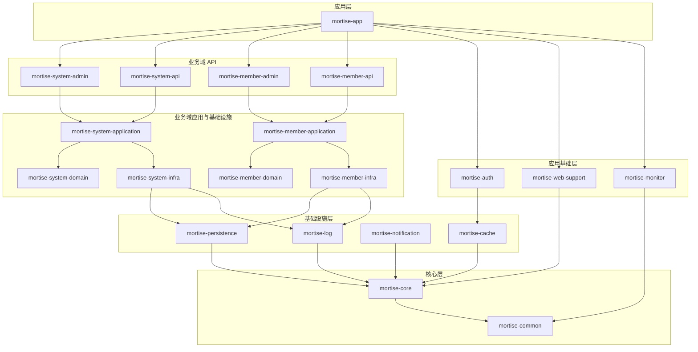

## 项目架构优化

本项目采用“多模块单体 + 业务域分层”架构，保证模块边界清晰、可扩展。

### 分层说明

- L6 应用层：`mortise-app` 聚合启动与装配。
- L5 业务域 API：`*-admin` / `*-api` 对外提供接口。
- L4 业务域应用与基础设施：`*-application` / `*-infra` / `*-domain`。
- L3 应用基础层：`mortise-auth` / `mortise-web-support` / `mortise-monitor`。
- L2 基础设施层：`mortise-log` / `mortise-cache` / `mortise-notification` / `mortise-persistence`。
- L1 核心层：`mortise-common` / `mortise-core`。

### 依赖原则

- 同层不互相依赖。
- 依赖方向由上到下，禁止反向依赖。
- 业务域接口层只依赖本域 application 与基础模块。

### 架构图

