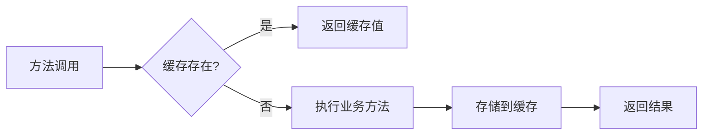

# 缓存策略优化说明

## 优化前的问题

在优化之前，`AuthServiceImpl` 和 `UserServiceImpl` 直接使用 `StringRedisTemplate` 操作缓存，存在以下问题：

1. **绕过缓存抽象层**：没有使用 Spring Cache 的统一抽象
2. **缓存策略分散**：TTL 硬编码在业务代码中
3. **序列化不一致**：使用不同的序列化方式
4. **缓存管理复杂**：缓存逻辑散布在各个服务中

## 优化后的架构

### 1. 统一缓存配置 (`CacheConfig`)

```java
@Configuration
@EnableCaching
public class CacheConfig {
    
    @Bean
    @Primary
    public CacheManager cacheManager(RedisConnectionFactory connectionFactory) {
        // 统一配置不同业务场景的缓存策略
        // 验证码缓存 - 5分钟
        // 刷新令牌缓存 - 24小时  
        // 密码重置缓存 - 30分钟
        // 用户信息缓存 - 1小时
        // 用户会话缓存 - 2小时
        // ...
    }
}
```

**优势：**
- 集中管理所有缓存策略
- 统一的序列化配置
- 支持事务
- 易于维护和调整

### 2. 统一缓存服务抽象层 (`CacheService`)

```java
public interface CacheService {
    // 认证相关缓存
    void storeVerificationCode(String email, String code);
    String getVerificationCode(String email);
    void removeVerificationCode(String email);
    
    void storeRefreshToken(String refreshToken, String account);
    String getAccountByRefreshToken(String refreshToken);
    void removeRefreshToken(String refreshToken);
    
    // 通用缓存操作
    void putString(String cacheName, String key, String value);
    String getString(String cacheName, String key);
    void evict(String cacheName, String key);
    <T> T getObject(String cacheName, String key, Class<T> clazz);
    
    // 用户相关缓存
    void storeCurrentAccount(String currentAccount);
    String getCurrentAccount();
    void evictUserCache(Long userId);
    void evictAllUserCache();
}
```

**优势：**
- 统一管理所有业务模块的缓存操作
- 业务逻辑与缓存实现解耦
- 提供通用缓存操作方法，减少重复代码
- 便于单元测试和mock
- 支持缓存实现的切换

### 3. Spring Cache 注解使用示例 (`UserCacheServiceImpl`)

```java
@Service
public class UserCacheServiceImpl {
    
    @Cacheable(value = CacheConstant.USER_INFO_CACHE, key = "#userId")
    public User getCachedUserInfo(Long userId) {
        return userService.getById(userId);
    }
    
    @CachePut(value = CacheConstant.USER_INFO_CACHE, key = "#user.id")
    public User updateUserInfo(User user) {
        userService.updateById(user);
        return user;
    }
    
    @CacheEvict(value = CacheConstant.USER_INFO_CACHE, key = "#userId")
    public void evictUserCache(Long userId) {
        // 清除缓存
    }
}
```

**优势：**
- 声明式缓存管理
- 自动缓存键生成
- 条件缓存控制
- 缓存同步更新

## 缓存策略生效机制

### 1. 配置生效流程

1. **@EnableCaching** 启用 Spring Cache 支持
2. **CacheManager Bean** 注册到 Spring 容器
3. **缓存配置映射** 为不同缓存名称配置不同策略
4. **AOP代理** 拦截带缓存注解的方法调用

### 2. 缓存操作流程



### 3. 缓存键策略

- **验证码缓存**: `mortise:cache:verificationCode:{email}`
- **刷新令牌缓存**: `mortise:cache:authToken:auth:refresh_token:{token}`
- **密码重置缓存**: `mortise:cache:passwordReset:{resetToken}`
- **用户信息缓存**: `mortise:cache:userInfo:{userId}`

## 主要改动说明

### 1. AuthServiceImpl 优化

**原来：**
```java
@Resource
private StringRedisTemplate stringRedisTemplate;

public Boolean register(String email, String code) {
    String validateCode = stringRedisTemplate.boundValueOps(key).get();
    // ...
    stringRedisTemplate.delete(key);
}
```

**现在：**
```java
@Resource
private CacheService cacheService;

public Boolean register(String email, String code) {
    String validateCode = cacheService.getVerificationCode(email);
    // ...
    cacheService.removeVerificationCode(email);
}
```

### 2. JavaMailServiceImpl 优化

**原来：**
```java
redisTemplate.boundValueOps(key).set(code, 5, TimeUnit.MINUTES);
```

**现在：**
```java
cacheService.storeVerificationCode(to, code);
```

### 3. UserServiceImpl 优化

**原来：**
```java
@Resource
private StringRedisTemplate stringRedisTemplate;

public String nextAccount() {
    String currentAccount = stringRedisTemplate.boundValueOps(CURRENT_ACCOUNT_KEY).get();
    // ...
    stringRedisTemplate.boundValueOps(CURRENT_ACCOUNT_KEY).set(currentAccount);
}
```

**现在：**
```java
@Resource
private CacheService cacheService;

public String nextAccount() {
    String currentAccount = cacheService.getCurrentAccount();
    // ...
    cacheService.storeCurrentAccount(currentAccount);
}
```

### 4. 新增缓存常量

在 `CacheConstant` 中添加了认证相关和用户业务相关的缓存配置：

```java
// 认证相关缓存名称
public static final String AUTH_TOKEN_CACHE = "authToken";
public static final String VERIFICATION_CODE_CACHE = "verificationCode"; 
public static final String PASSWORD_RESET_CACHE = "passwordReset";

// 用户业务相关缓存名称
public static final String ACCOUNT_SEQUENCE_CACHE = "accountSequence";

// 过期时间配置
public static final int REFRESH_TOKEN_EXPIRE_HOURS = 24;
public static final int VERIFICATION_CODE_EXPIRE_MINUTES = 5;
public static final int PASSWORD_RESET_EXPIRE_MINUTES = 30;
public static final int ACCOUNT_SEQUENCE_EXPIRE_HOURS = 24 * 365; // 1年
```

## 性能和维护优势

### 1. 性能优势
- **统一序列化**：减少序列化开销
- **连接池复用**：更好的连接管理
- **批量操作支持**：支持缓存批量清理

### 2. 维护优势
- **集中配置**：所有缓存策略在一处管理
- **类型安全**：编译时检查缓存操作
- **监控友好**：更好的缓存监控和统计

### 3. 扩展优势
- **多级缓存**：支持本地缓存+Redis的多级缓存
- **缓存切换**：可以轻松切换缓存实现
- **条件缓存**：支持基于条件的缓存策略

## 使用建议

### 1. 业务缓存推荐使用注解方式
```java
@Cacheable(value = "businessCache", key = "#param")
public Result getBusinessData(String param) {
    // 业务逻辑
}
```

### 2. 认证缓存推荐使用服务封装
```java
authCacheService.storeVerificationCode(email, code);
String code = authCacheService.getVerificationCode(email);
```

### 3. 缓存清理策略
- **定时清理**：定期清理过期缓存
- **事件驱动**：基于业务事件清理相关缓存
- **手动清理**：提供管理接口手动清理缓存

这样的架构设计使得缓存管理更加规范、高效和易于维护。

## 架构设计决策：统一 CacheService vs 分模块缓存服务

### 选择统一 CacheService 的原因

在重构过程中，我们面临一个选择：是为每个业务模块创建独立的缓存服务（如 `AuthCacheService`、`UserCacheService`），还是创建一个统一的 `CacheService`？

**我们选择了统一 CacheService 的方案，原因如下：**

#### 1. 避免服务碎片化
- 如果每个业务模块都有自己的缓存服务，会导致大量的 `XxxCacheService` 类
- 增加了项目的复杂性，不利于维护

#### 2. 减少重复代码
- 不同模块的缓存操作本质上都是相似的（存储、获取、删除）
- 统一服务可以提供通用的缓存操作方法，避免重复实现

#### 3. 统一管理和监控
- 所有缓存操作都通过一个服务，便于统一监控和日志记录
- 便于实现统一的缓存策略和安全控制

#### 4. 灵活性和扩展性
- 可以根据需要在统一服务中添加特定业务的便捷方法
- 保持了高内聚，低耦合的设计原则

### 最终架构

```
CacheService (统一缓存服务)
├── 认证相关缓存操作
│   ├── storeVerificationCode()
│   ├── storeRefreshToken()
│   └── storePasswordResetToken()
├── 用户相关缓存操作  
│   ├── storeCurrentAccount()
│   ├── evictUserCache()
│   └── evictAllUserCache()
└── 通用缓存操作
    ├── putString()
    ├── getString()
    ├── putObject()
    └── getObject()
```

这种设计既保持了业务逻辑的清晰性，又避免了过度设计，是一个平衡的解决方案。