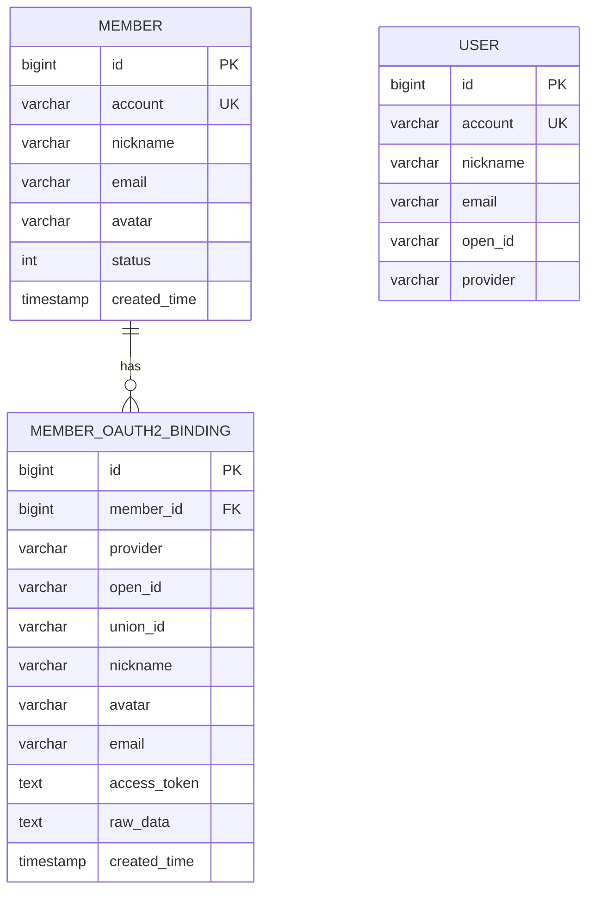
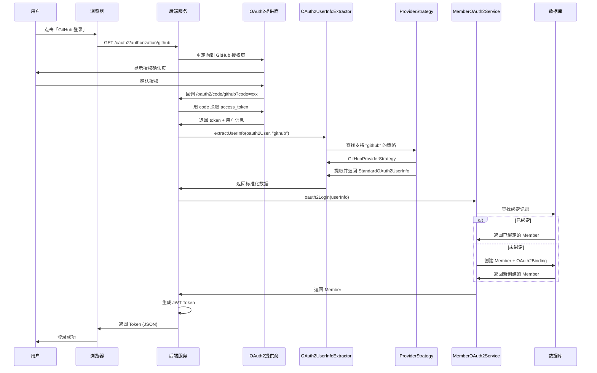
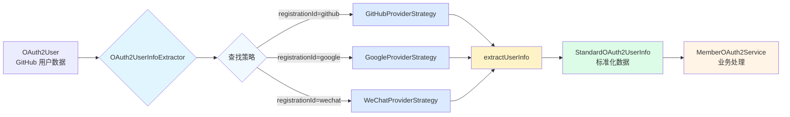
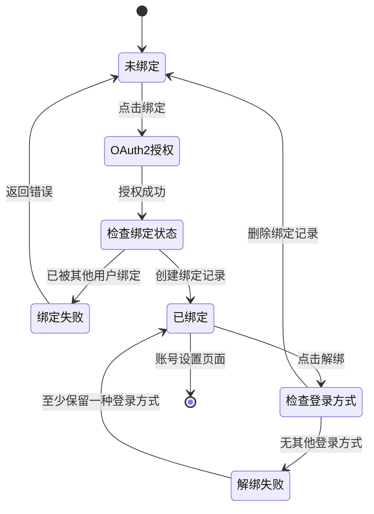
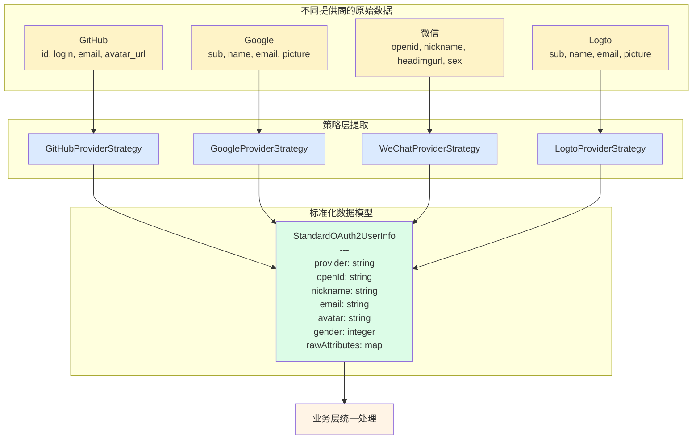
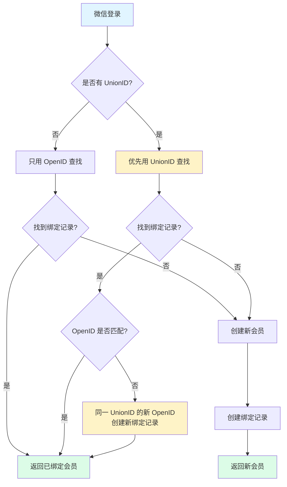

# OAuth2 多提供商架构图

## 整体架构

```mermaid
graph TB
    subgraph "mortise-auth 基础设施层"
        A1[OAuth2ProviderStrategy<br/>SPI 接口]
        A2[StandardOAuth2UserInfo<br/>标准化数据模型]
        A3[OAuth2UserInfoExtractor<br/>用户信息提取器]
        
        subgraph "提供商策略实现 (开箱即用)"
            C1[GitHubProviderStrategy]
            C2[GoogleProviderStrategy]
            C3[WeChatProviderStrategy]
            C4[LogtoProviderStrategy]
        end
    end

    subgraph "mortise-member 业务层"
        B1[MemberOAuth2Service<br/>业务逻辑接口]
        B2[MemberOAuth2ServiceImpl<br/>业务逻辑实现]
        
        subgraph "数据持久层"
            D1[(Member<br/>会员表)]
            D2[(MemberOAuth2Binding<br/>绑定表)]
        end
    end

    subgraph "mortise-system 管理层"
        E1[(User<br/>系统用户表)]
        E2[AuthService]
    end

    C1 -.实现.-> A1
    C2 -.实现.-> A1
    C3 -.实现.-> A1
    C4 -.实现.-> A1
    
    A3 -->|使用| A1
    A3 -->|返回| A2
    
    B2 -->|调用| A3
    B2 -->|操作| D1
    B2 -->|操作| D2
    B1 <-.实现.- B2
    
    E2 -->|调用| A3
    E2 -->|管理员登录| E1

    style A1 fill:#e1f5ff
    style A2 fill:#e1f5ff
    style A3 fill:#e1f5ff
    style B1 fill:#fff4e6
    style B2 fill:#fff4e6
    style C1 fill:#d1fae5
    style C2 fill:#d1fae5
    style C3 fill:#d1fae5
    style C4 fill:#d1fae5
    style D1 fill:#f3f4f6
    style D2 fill:#f3f4f6
    style E1 fill:#fef3c7
    style E2 fill:#fef3c7
```

## 数据模型关系



## OAuth2 登录时序图



## 策略模式工作流程



## 账号绑定/解绑流程



## 多提供商数据标准化



## 微信 UnionID 处理流程



---

**说明**：

1. **整体架构图**：展示三层架构关系
2. **数据模型关系图**：展示数据库表关系
3. **登录时序图**：完整的 OAuth2 登录流程
4. **策略模式工作流程**：展示策略自动选择机制
5. **账号绑定/解绑流程**：状态转换图
6. **数据标准化流程**：展示不同提供商数据的统一化
7. **微信 UnionID 处理**：展示微信特殊场景的处理逻辑

这些图表可以直接在支持 Mermaid 的 Markdown 查看器中渲染（如 GitHub、Typora、VS Code）。
