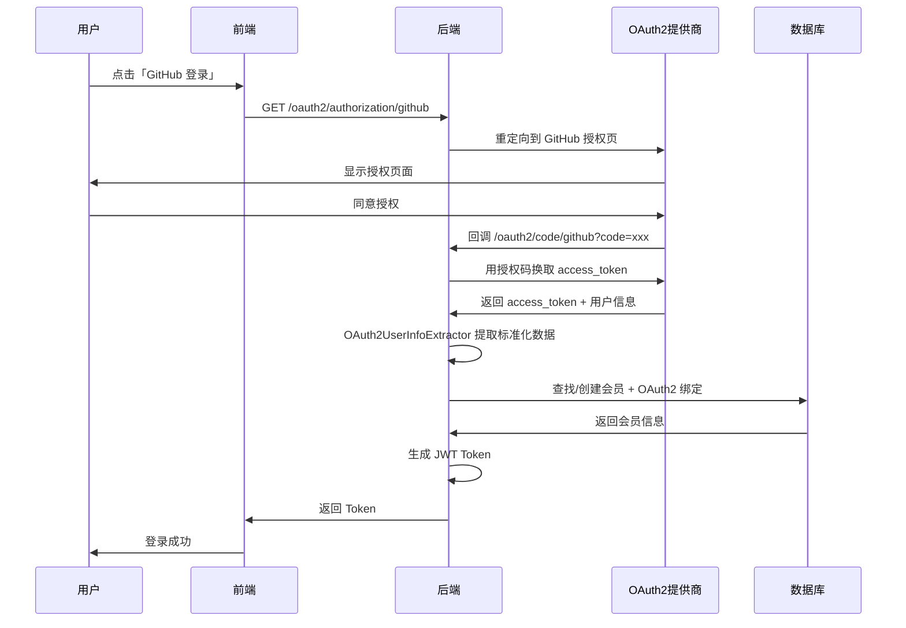
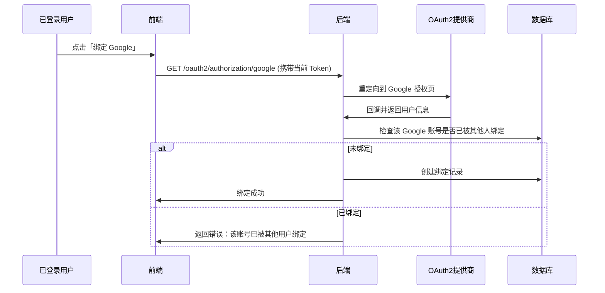

# OAuth2 多提供商扩展架构 - 总结报告

## 📊 项目概况

为 mortise 项目设计并实现了一套可扩展的 OAuth2 多提供商认证架构，支持 GitHub、Google、微信等第三方登录。

---

## 🎯 核心设计目标

### 1. 业务场景分离

| 模块 | 用户类型 | 数据表 | OAuth2 提供商 | 使用场景 |
|------|---------|--------|--------------|---------|
| `mortise-system` | 系统管理员 | `mortise_user` | Logto (OIDC) | 管理后台单点登录 |
| `mortise-member` | 普通会员 | `mortise_member` | GitHub/Google/微信等 | 用户端多种登录方式 |

### 2. 架构分层

```
┌─────────────────────────────────────────┐
│   mortise-auth (基础设施层)              │
│   - OAuth2ProviderStrategy (SPI)       │
│   - StandardOAuth2UserInfo (数据模型)   │
│   - OAuth2UserInfoExtractor (提取器)    │
└─────────────────────────────────────────┘
                    ▲
                    │ 依赖
                    │
┌─────────────────────────────────────────┐
│   mortise-member (业务层)                │
│   - MemberOAuth2Service (业务逻辑)       │
│   - GitHubProviderStrategy              │
│   - GoogleProviderStrategy              │
│   - WeChatProviderStrategy              │
│   - LogtoProviderStrategy               │
└─────────────────────────────────────────┘
```

---

## 🗂️ 文件清单

### 核心接口与模型 (mortise-auth)

| 文件 | 说明 |
|------|------|
| `OAuth2ProviderStrategy.java` | OAuth2 提供商策略接口 (SPI) |
| `StandardOAuth2UserInfo.java` | 标准化的 OAuth2 用户信息模型 |
| `OAuth2UserInfoExtractor.java` | 自动选择策略并提取用户信息 |

### 提供商策略实现 (mortise-member)

| 文件 | 说明 |
|------|------|
| `GitHubProviderStrategy.java` | GitHub 策略 |
| `GoogleProviderStrategy.java` | Google 策略 |
| `WeChatProviderStrategy.java` | 微信策略 |
| `LogtoProviderStrategy.java` | Logto 策略 |

### 数据实体 (mortise-member)

| 文件 | 说明 |
|------|------|
| `Member.java` | 会员用户实体 |
| `MemberOAuth2Binding.java` | OAuth2 绑定关系实体 |

### 业务逻辑 (mortise-member)

| 文件 | 说明 |
|------|------|
| `MemberOAuth2Service.java` | OAuth2 业务接口 |
| `MemberOAuth2ServiceImpl.java` | OAuth2 业务实现 |
| `MemberOAuth2LoginSuccessHandler.java` | 登录成功处理器 |

### 数据库与文档

| 文件 | 说明 |
|------|------|
| `docs/sql/member_oauth2_schema.sql` | 数据库建表脚本 |
| `docs/OAUTH2_MULTI_PROVIDER_DESIGN.md` | 详细设计文档 |
| `docs/OAUTH2_QUICK_START.md` | 快速开始指南 |

---

## 🔑 核心特性

### 1. 开放封闭原则

✅ **对扩展开放**：新增提供商只需实现策略接口  
✅ **对修改封闭**：无需修改核心代码

```java
// 新增 Facebook 支持，只需创建一个类
@Component
public class FacebookProviderStrategy implements OAuth2ProviderStrategy {
    // 实现接口方法即可
}
```

### 2. 策略自动发现

Spring Boot 自动扫描并注入所有策略实现：

```java
@Autowired
public OAuth2UserInfoExtractor(Optional<List<OAuth2ProviderStrategy>> strategies) {
    // 自动注入所有实现了 OAuth2ProviderStrategy 的 Bean
}
```

### 3. 数据标准化

不同提供商的用户数据统一转换为 `StandardOAuth2UserInfo`：

| 提供商 | OpenID 来源 | 昵称来源 | 头像来源 |
|--------|------------|---------|---------|
| GitHub | `id` | `login` | `avatar_url` |
| Google | `sub` | `name` | `picture` |
| 微信 | `openid` | `nickname` | `headimgurl` |
| Logto | `sub` | `name` | `picture` |

### 4. 多账号绑定

支持一个会员绑定多个 OAuth2 账号：

```
会员 A
├── GitHub 账号 ✓
├── Google 账号 ✓
└── 微信账号 ✓
```

### 5. 微信特殊支持

支持微信 UnionID，解决开放平台多应用场景：

```sql
-- 同一个用户在不同微信应用下有不同的 openid
-- 但 unionid 相同，可以关联
SELECT * FROM mortise_member_oauth2_binding 
WHERE union_id = 'o6_bmasdasdsad6_2sgVt7hMZOPfL';

-- 结果：
-- app1: openid=xxx1, unionid=o6_bmasdasdsad6_2sgVt7hMZOPfL
-- app2: openid=xxx2, unionid=o6_bmasdasdsad6_2sgVt7hMZOPfL
```

---

## 📋 业务流程

### OAuth2 登录流程



### 账号绑定流程



---

## 🔧 配置示例

### application.yml

```yaml
spring:
  security:
    oauth2:
      client:
        registration:
          github:
            client-id: ${GITHUB_CLIENT_ID}
            client-secret: ${GITHUB_CLIENT_SECRET}
            scope: read:user,user:email
          
          google:
            client-id: ${GOOGLE_CLIENT_ID}
            client-secret: ${GOOGLE_CLIENT_SECRET}
            scope: openid,profile,email
          
          wechat:
            client-id: ${WECHAT_APP_ID}
            client-secret: ${WECHAT_APP_SECRET}
            scope: snsapi_login
            client-authentication-method: client_secret_post
            provider: wechat
        
        provider:
          wechat:
            authorization-uri: https://open.weixin.qq.com/connect/qrconnect
            token-uri: https://api.weixin.qq.com/sns/oauth2/access_token
            user-info-uri: https://api.weixin.qq.com/sns/userinfo
            user-name-attribute: openid
```

---

## 📊 数据库设计

### mortise_member (会员表)

```sql
CREATE TABLE mortise_member (
    id BIGINT PRIMARY KEY,
    account VARCHAR(50) UNIQUE,
    nickname VARCHAR(50),
    email VARCHAR(100),
    avatar VARCHAR(255),
    status INTEGER DEFAULT 1,
    created_time TIMESTAMP
);
```

### mortise_member_oauth2_binding (绑定表)

```sql
CREATE TABLE mortise_member_oauth2_binding (
    id BIGINT PRIMARY KEY,
    member_id BIGINT,                 -- 关联会员
    provider VARCHAR(50),              -- github/google/wechat
    open_id VARCHAR(100),              -- OAuth2 唯一标识
    union_id VARCHAR(100),             -- 微信 UnionID
    nickname VARCHAR(100),             -- OAuth2 昵称
    avatar VARCHAR(255),               -- OAuth2 头像
    email VARCHAR(100),                -- OAuth2 邮箱
    access_token TEXT,                 -- 访问令牌
    raw_data TEXT,                     -- 原始数据 (JSON)
    created_time TIMESTAMP,
    UNIQUE (provider, open_id)
);
```

**设计要点**：
- `(provider, open_id)` 唯一约束，防止重复绑定
- 支持 `union_id` 字段，处理微信开放平台
- 保存 `raw_data` 原始数据，便于后续扩展

---

## 🚀 快速开始

### 1. 配置环境变量

```bash
export GITHUB_CLIENT_ID=your_github_client_id
export GITHUB_CLIENT_SECRET=your_github_client_secret
export GOOGLE_CLIENT_ID=your_google_client_id
export GOOGLE_CLIENT_SECRET=your_google_client_secret
```

### 2. 执行数据库迁移

```bash
psql -U postgres -d mortise -f docs/sql/member_oauth2_schema.sql
```

### 3. 启动应用

```bash
mvn clean install
mvn spring-boot:run
```

### 4. 测试登录

浏览器访问：
```
http://localhost:8080/oauth2/authorization/github
```

成功后返回：
```json
{
  "code": 200,
  "data": {
    "token": "eyJhbGciOiJIUzI1NiIsInR5cCI6IkpXVCJ9...",
    "refreshToken": "01HXXX..."
  }
}
```

---

## ✅ 优势总结

| 特性 | 说明 |
|------|------|
| **零侵入扩展** | 新增提供商无需修改核心代码 |
| **类型安全** | 编译时检查，避免运行时错误 |
| **数据标准化** | 统一的用户信息模型 |
| **多账号绑定** | 支持一个用户绑定多个 OAuth2 账号 |
| **微信特殊支持** | 支持 UnionID，解决开放平台场景 |
| **灵活配置** | 支持动态启用/禁用提供商 |
| **数据同步** | 保存原始数据，便于后续同步更新 |
| **生产就绪** | 考虑了安全、性能、特殊场景 |

---

## 📚 文档索引

1. **[OAuth2 多提供商设计文档](OAUTH2_MULTI_PROVIDER_DESIGN.md)** - 详细的架构设计
2. **[OAuth2 快速开始指南](OAUTH2_QUICK_START.md)** - 快速上手教程
3. **[数据库建表脚本](sql/member_oauth2_schema.sql)** - 数据库迁移

---

## 🎉 总结

这套 OAuth2 多提供商架构具有以下特点：

✅ **架构清晰**：分层合理，职责明确  
✅ **易于扩展**：SPI 机制，开箱即用  
✅ **生产就绪**：考虑了实际业务场景  
✅ **文档完善**：设计文档 + 快速开始指南

**下一步建议**：

1. 实现前端登录页面（第三方登录按钮）
2. 实现账号设置页面（绑定/解绑管理）
3. 添加更多提供商（Facebook、Twitter、钉钉等）
4. 实现令牌刷新机制
5. 添加单元测试和集成测试

---

**需要帮助？**

如有疑问，请参考：
- 设计文档：`docs/OAUTH2_MULTI_PROVIDER_DESIGN.md`
- 快速开始：`docs/OAUTH2_QUICK_START.md`
- 或提交 Issue 到项目仓库
